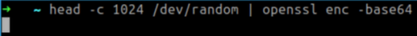
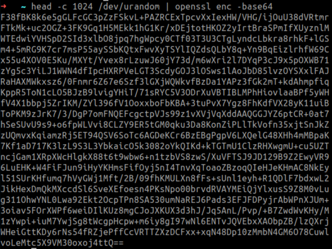
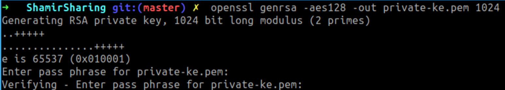
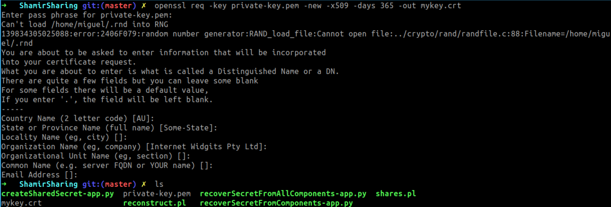
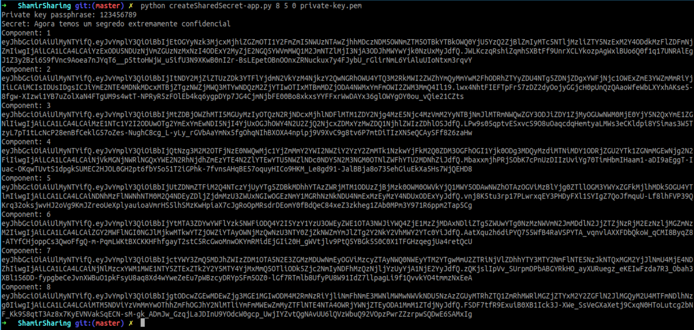
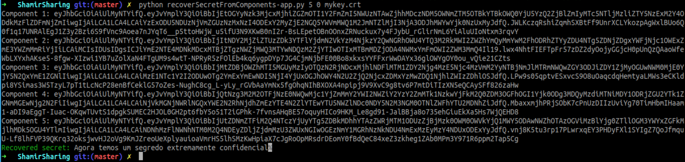
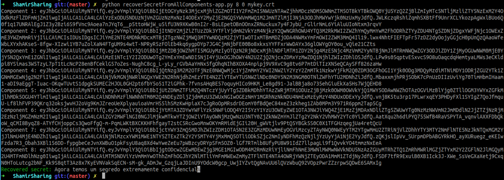
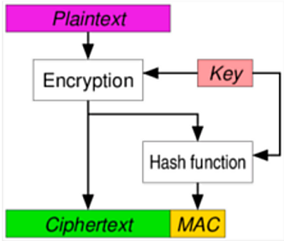
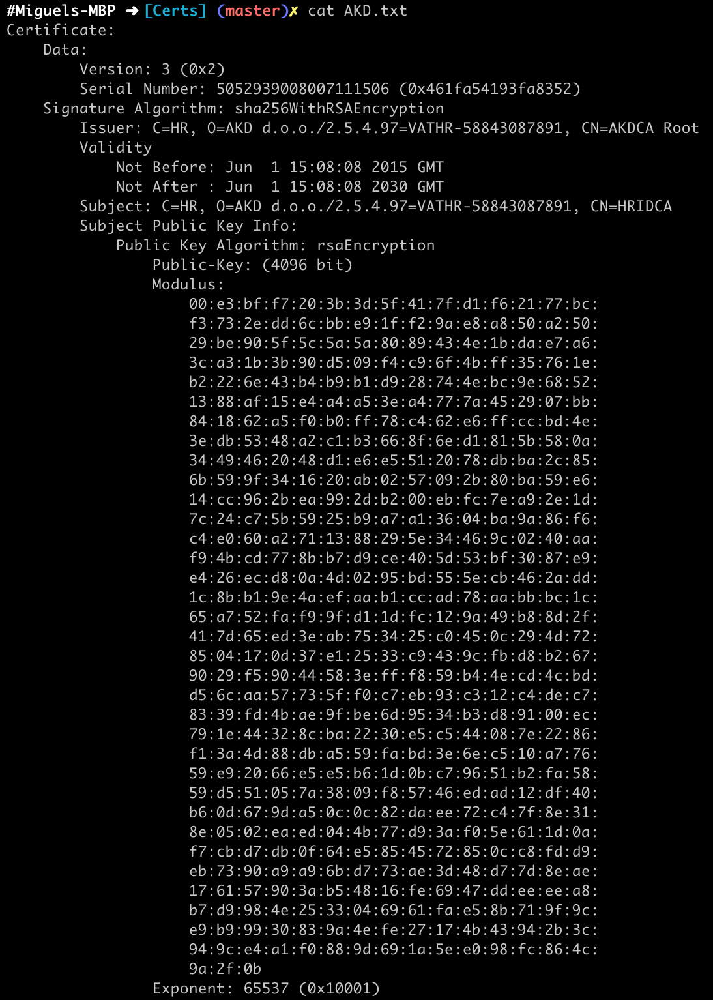
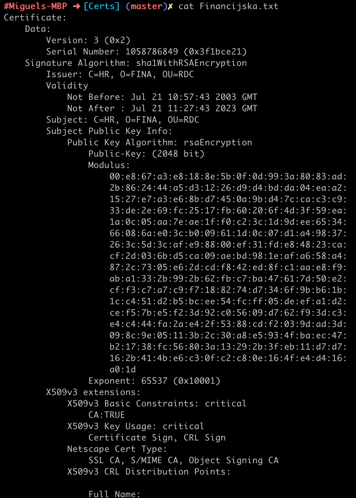

# Aula TP - 11/Fev/2019

Segue-se as respostas às perguntas dos exercícios propostos na aula que decorreu no dia 11 de Fevereiro de 2019.

## Exercícios

### 1\. Números aleatórios/pseudoaleatórios


#### Resposta à pergunta P1.1

Após testar os comandos pedidos destaca-se, primeiramente, a diferença entre os comandos `head -c 1024 /dev/random | openssl enc -base64` e `head -c 1024 /dev/urandom | openssl enc -base64`. 

Ao executar o primeiro comando verifcou-se que este bloqueia temporariamente até devolver o número bytes requisitado (1024 neste caso). Isto deve-se à falta de entropia 
disponível no sistema. Assim, quando o valor da entropia é inferior a um dado valor (threshold), operações de leitura são bloqueadas até que seja captado algum ruído 
adicional do ambiente, ficando o dispositivo até lá à espera.



Já o comando `head -c 1024 /dev/urandom | openssl enc -base64` não bloqueia quando o nível de entropia é baixo, devolvendo um valor de forma imediata, pois o mesmo reutiliza o 
pool interno para produzir mais bits pseudo-aleatórios, o que é menos seguro, podendo este ser vulnerável a ataques criptográficos, contudo é bastante mais rápido que o 
anterior.



Deste modo, apesar do `/dev/urandom` ser criptograficamente seguro, apenas deve ser considerado quando o desempenho obtido com o uso do `/dev/random/` não satisfizer os 
requisitos pretendidos pela aplicação em causa.

Em relação aos restantes comandos, que envolvem valores de comprimento inferior a 1024 bytes, observa-se que a invocação dos mesmos devolve o resultado de maneira imediata. 
Adicionalmente, para o gerador `/dev/random`, quanto maior o número de bytes pedidos, maior é a quantidade de tempo necessário para gerar o valor pedido.


#### Resposta à pergunta P1.2

O haveged - <http://www.issihosts.com/haveged/index.html> - é um daemon de entropia baseado no algoritmo HAVEGE (_HArdware Volatile Entropy Gathering and Expansion_) - 
<http://www.irisa.fr/caps/projects/hipsor/> -, quem tem como objetivo corrigir condições de baixa entropia no dispositivo aleatório do Linux. O uso do mesmo aumenta 
assim a entropia do gerador usando fontes adicionais baseadas em características do hardware atual.

Com a instalação desta ferramenta, e após testar novamente os comandos `head -c 1024 /dev/random | openssl enc -base64` e `head -c 1024 /dev/urandom | openssl enc -base64`, 
a diferença no tempo de espera pela resposta de ambos deixa de ser notória, graças à considerável diminuição do tempo de resposta da fonte `dev/random`.

#### Resposta à pergunta P1.3

Ao analisar o ficheiro *generateSecret-app.py* baseado no módulo eVotUM.Cripto (https://gitlab.com/eVotUM/Cripto-py) observa-se que a função `generateSecret` recorre ao módulo 
*shamirsecret.py*. Neste módulo a função `generateSecret` gera uma sequência de bytes pseudoaleatórios e remove da mesma todos os caractéres que não satisfaçam a condição:
`if c in (string.ascii_letters + string.digits)` **i.e.** que não sejam nem letras nem números. Enquanto o número de bytes que satisfizeram a condição dada não for igual ao pedido
(`l<secretLength`), este processo repete-se. Deste modo, facilmente se justifica o facto de o segredo gerado ser composto apenas por letras e números, pois a função referida 
filtra os valores obtidos para que o segredo contenha apenas caracteres pertencentes a `string.ascii_letters` e `string.digits`.
Esta limitição poderia ser facilmente ultrapassada removendo a condição que filtra os valores que não são números nem letras e convertendo o resultado para Base64 para permitir
a representação dos caractéres não imprimíveis.

### 2\. Partilha/Divisão de segredo (Secret Sharing/Splitting)

#### Resposta à pergunta P2.1

O ficheiro *createSharedSecret-app.py* permite fazer a divisão de um segredo pelos elementos de um grupo. Cada elemento do mesmo recebe uma porção de “código” que, quando combinadas, permitem
a reconstrução do segredo que lhes deu origem. Assim, o input deste programa é constituído por quatro argumentos: o número de partes em que se vai dividir o segredo, o número 
mínimo de partes para a reconstrução do segredo (quorum), o identificador do segredo e a chave privada em formato Base64.

Posto isto, para efectuar a divisão pretendida começou-se por gerar a chave privada, através do seguinte comando:

`openssl genrsa -aes128 -out private-key.pem 1024`




E para assinar as partes constituintes do segredo, recorreu-se ao seguinte certificado:

`openssl req -key private-key.pem -new -x509 -days 365 -out mykey.cert`



Posteriormente, a invocação do comando que se segue permitiu efetuar a divisão do segredo "Agora temos um segredo extremamente confidencial" nas 8 partes pretendidas, com um quorum de 5:
`python createSharedSecret-app.py 8 5 0 private-key.pem`:



Por fim, a recuperação do segredo inicial a partir das suas partes constituintes pode ser efetuada com recurso ao ficheiro *recoverSecretFromComponents-app.py*, que permite a recuperação do 
mesmo a partir de um sub-conjunto das partes, que deve ter no mínimo tantos elementos como o quorum (neste caso 5);


ou recorrendo ao ficheiro *recoverSecretFromAllComponents-app.py* que 
exige a presença de todas as partes para recuperar o segredo original. 

Um cenário em que seria desejável a utilização deste último script seria o caso em que é necessário o 
consentimento de todas as partes para gerar o segredo original, garantindo um maior nível de confiabilidade na recuperação do segredo.



### 3\. Authenticated Encryption

#### Resposta à pergunta P3.1

Por forma a garantir a confidencialidade do segredo seria recomendado utilizar uma cifra que, combinada com um MAC num esquema Encrypt-then-MAC e aplicada sobre a etiqueta e o criptograma,
permitiria ainda garantir a integridade e autenticidade do mesmos.



A implementação deste algoritmo seguiria, portanto, a seguinte especificação:
```
def cipher(ptxt,lbl):
	ctxt = cifra(ptxt)
	id = getId()
	res = hmac(id, lbl + ctxt) + lbl + ctxt
	return res

def decipher(ctxt):
    r_hmac = gethmac(ctxt)
    id, lbl, ctxt = getcomponents(ctxt)
    if hmac (id, lbl + ctxt) == r_hmac:
        decifra(ctxt,id)
    else:
        return ‘Erro’
```

em que:

- `getID`: função que calcula o identificador “ano.mes.dia” para um dado criptograma, permitindo ao hardware gerar a chave para a cifra e para o MAC
- `getcomponets`: função que retorna a etiqueta, o criptograma e o identificador
- `gethmac`: função que extrai o hmac do texto cifrado

### 4\. Algoritmos e tamanhos de chaves

#### Resposta à pergunta P4.1

Consultou-se o site https://webgate.ec.europa.eu/tl-browser/, com o objetivo de identificar os algoritmos e tamanhos de chave utilizados nos certificados das Entidades de Certificação (EC) que emitem certificados digitais qualificados da Croácia, nomeadamente nas EC’s AKD d.o.o e Financijska agencija.

Extraindo os certificados em formato Base64 e inserindo `-----BEGIN CERTIFICATE-----` e `-----END CERTIFICATE-----` no início e fim do ficheiro 
respetivamente obtém-se dois certificados no formato PEM.
A invocação do comando `openssl x509 -in certificate.crt -text -noout > certificate.txt` permite guardar em `certificate.txt` a informação relativa
ao certificado em formato texto que pode ser usada para obter os parâmetros requisitados.

#### EC AKD d.o.o
Esta entidade certificadora recorre  ao certificado [HR electronic IDentity](https://webgate.ec.europa.eu/tl-browser/#/tl/HR/1/0) para assinar 
certificados digitais qualificados.
Inspecionando o ficheiro [AKD.txt](Certs/AKD.txt), que corresponde ao formato texto deste certificado, é possível identificar que o algoritmo utilizado
na emissão de certificados combina a função SHA-256 com a cifra RSA utilizando uma chave de tamanho 4096 bits:



#### EC Financijska agencija 
Esta entidade certificadora emite o certificado [FINA Digital Certificate Registry -QC](https://webgate.ec.europa.eu/tl-browser/#/tl/HR/0/0).

Mais uma vez, inspeccionando o ficheiro [Financijska.txt](Certs/Financijska.txt), que corresponde ao formato texto deste certificado, é possível 
identificar que o algoritmo utilizado na emissão de certificados é o SHA1 com cifragem RSA sendo que o tamanho da chave é 2048 bits:



Neste caso, é desaconcelhado o uso desta função de hash dado ter sido encontrada uma maneira sistemática de produzir colisões na mesma (conf. [SHAttered](https://shattered.io/)) sendo preferível o uso de uma função da família SHA-2 (e.g.:**SHA-256**) ou até mesmo da família SHA-3 (e.g.: **SHAKE128**).


Com base nas seguintes fontes: https://www.keylength.com e https://www.keylength.com, recolheu-se um leque de informações relativas às recomendações existentes para o SHA256 e SHA1, respetivamente. E, tendo em conta as informações recolhidas, é possível concluir que o SHA1 é desaconselhado para curto e longo prazo. No entanto, o SHA256 é considerado seguro para um tamanho de chave igual ou superior a 3072 bits, durante um considerável período de tempo (NIST: 2016-2030), abrangendo a validade do certificado em causa e satisfazendo o tamanho de chave aconselhado.
Posto isto, seria benéfico que a EC Financijska agencija adopta-se também o SHA256 com RSA.


