# Aula TP - 18/Fev/2019


## Assinaturas cegas baseadas em ECDLP (Elliptic Curve Discrete Logarithm Problem)

### Experiência 1.1
A invocação da sequência de comandos:

```
$ openssl ecparam -name prime256v1 -genkey -noout -out key.pem
$ openssl req -key key.pem -new -x509 -days 365 -out key.crt
```

resulta na criação de dois ficheiros [`key.pem`](BlindSignatures/key.pem) e [`key.crt`](BlindSignatures/key.crt) que consistem na chave privada e
certificado para assinatura associado à mesma, respetivamente.

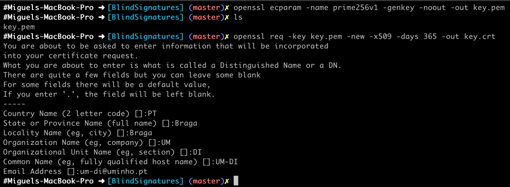

### Experiência 1.2

O processo de assinatura cega compreende cinco fases distintas que permitem transformar os dados a serem assinados de maneira a que 
a assinatura dos dados ofuscados possa ser convertida numa assinatura válida dos dados desofuscados.
Como tal de seguida apresenta-se o resultado de realizar cada uma dessas fases em sequência:

1. Inicialização: 

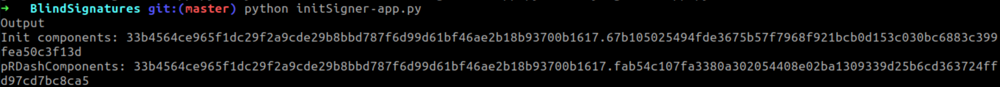

2. Ofuscação:

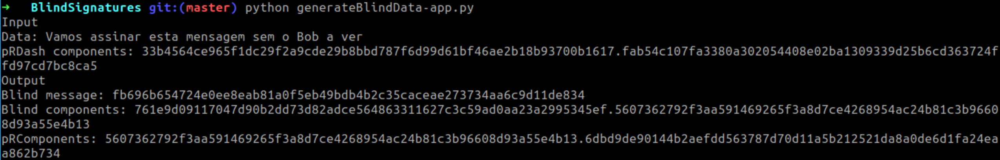

3. Assinatura:

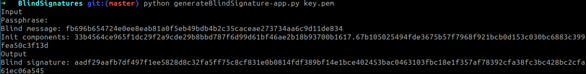


4. Desofuscação:

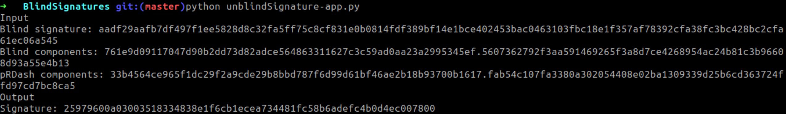


5. Verificação:

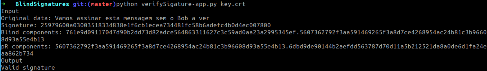

### Pergunta 1.1

Para suportar as funcionalidades requisitadas foi usado o módulo `getopt` que permite especificar um conjunto 
predefinido de opções de linha comandos (e valores caso aplicável).

Como tal, no caso do ficheiro [`init-app.py`](BlindSignatures/init-app.py), foi usada a seguinte invocação que 
define como argumento `--init`: 
```
args, _ = getopt.getopt(sys.argv[1:], "", ["init"])
```
Quando esta opção se encontra presente é gerado um ficheiro chamado "assinante" que contém os parametros 
**InitComponents** e **pRDashComponents**:

```
initComponents, pRDashComponents = eccblind.initSigner()
sig_file = open("assinante", "w")
sig_file.write("Init components: %s\n" % initComponents)
sig_file.write("pRDashComponents: %s\n" % pRDashComponents)
sig_file.close()
```
Após ter sido invocado o comando `$ python init-app.py --init` que cria o ficheiro "assinante", o assinante pode consultar 
o parametro **pRDashComponents** invocando apenas `$ python init-app.py`:

```
initComponents, pRDashComponents = tuple(open("assinante", "r").readlines())
pRDashComponents = pRDashComponents.split(' ')[1]
print("pRDashComponents: %s" % pRDashComponents)
```

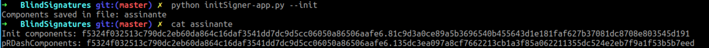


A ofuscação de dados por parte do requerente é conseguinda com recurso ao comando 
`$ python ofusca-app.py --msg <msg> --RDash <pRDashComponents>` implementado pelo *script* [`ofusca-app.py`](BlindSignatures/ofusca-app.py).
Como no caso do `init-app.py`, este define o conjunto de argumentos esperados e respetivos valores:
```
args, _ = getopt.getopt(sys.argv[1:], "", ["msg=", "RDash="])
```
O valor da mensagem e do **RDash** é lido dos argumentos passados ao *script* sendo obtida uma representação ofuscada dos dados:

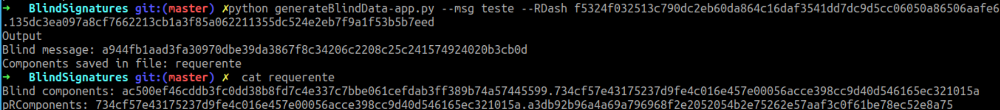

A assinatura dos dados ofuscados é conseguida através do *script* [blindSignature-app.py](BlindSignatures/blindSignature-app.py) que 
deve ser invocado da seguinte maneira `$ python blindSignature-app.py --key <pkey.pem> --bmsg <message>`.
A chave privada é identificada pelo ficheiro PEM onde está armazenada e a mensagem ofuscada deve ser passada como valor associado à 
opção `--bmsg`:
```
args, _ = getopt.getopt(sys.argv[1:], "", ["key=", "bmsg="])
args = dict(args)
if "--key" in args:
        eccPrivateKeyPath = args["--key"]
        if "--bmsg" in args:
            blindM = args["--bmsg"]
```
Neste caso é ainda requisitada a introdução, por parte do utilizador, dos componentes **passphrase** (palavra passe associada à chave privada)
e **initComponents** sendo gerada a assinatura da mensagem ofuscada:

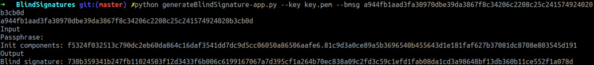

A desofuscação da assinatura é realizada pelo requerente com recurso ao *script* [desofusca-app.py](BlindSignatures/desofusca-app.py)que invoca o 
comando `$ python desofusca-app.py -s <Blind Signature> --RDash <pRDashComponents>` indicando a assinatura ofuscada bem como o valor de 
**pRDashComponents** no respetivo argumento:
```
args, _ = getopt.getopt(sys.argv[1:], "s:", ["RDash="])
args = dict(args)
if "-s" in args:
    blindSignature = args["-s"]
    if "--RDash" in args:
        pRDashComponents = args["--RDash"]
```
sendo posteriormente requisitado o valor dos **BlindComponents** `blindComponents = raw_input("Blind components: ")`.

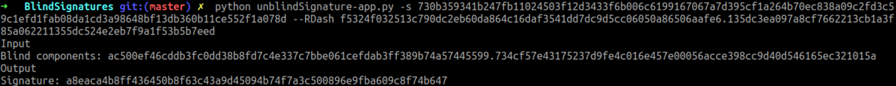

A verificação da assinatura é conseguida com recurso ao *script* [verify-app.py](BlindSignatures/verify-app.py), devendo ser indicado
o certificado associado à chave privada usada para assinar os dados bem como a mensagem original(desofuscada) e a respetiva assinatura:
`$ python verify-app.py --cert <certificate.crt> --msg <msg> --sDash <signature> -f <requerente>`.
Os componentes **BlindComponents** e **pRComponents** são lidos do ficheiro passado como argumento de `-f`:
```
if "-f" in args:
    blindComponents, pRComponents = tuple(open(args["-f"], "r").readlines())
    blindComponents = blindComponents.split(' ')[2]
    pRComponents = pRComponents.split(' ')[1]
```

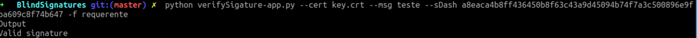

### 2\. Protocolo SSL/TLS

#### Experiência 2.1

Ao consultar o *site* [www.ssllabs.com](https://www.ssllabs.com/ssltest/) e ao efetuar o _SSL Server test_ para o *site* do Governo Português (<https://www.portugal.gov.pt/>), obteve-se um vasto conjunto de informações, entre as quais a indicação de que o mesmo possui *rating* A+, como se confirma com a imagem que se segue:


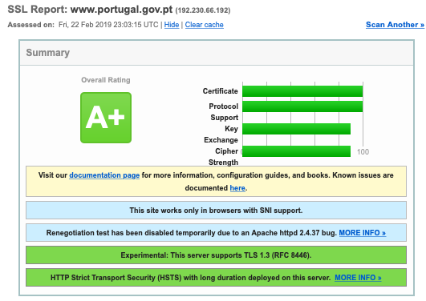

Adicionalmente é ainda interessante destacar o suporte para a versão mais recente do protocolo TLS, TLS 1.3.
Destaca-se ainda o suporte da extensão (ao protocolo TLS) SNI (Server Name Indication) que permite que um determinado host/IP apresente diferentes certificados 
consoante o serviço ao qual o cliente pretende aceder.


#### Resposta à Pergunta P2.1

As três Universidades Europeias, não Portuguesas, escolhidas foram: 
- [*University of Cambridge*](https://www.cam.ac.uk);
- [*University of Göttingen*](https://www.uni-goettingen.de/en/1.html);
- [*The University of Edinburgh*](https://www.ed.ac.uk/home).

Analisando os [Resultados obtidos](Resultados_SSL) ao efetuar o teste _SSL Server test_ aos *sites* acima referidos observa-se que o site com pior *rating* diz respeito à *University of Göttingen*, apresentado um *rating* B, ao passo que as restantes têm *rating* A (ou superior).


O *scan* SSL deste site apresenta dois comentários principais:
- *"This server supports weak Diffie-Hellman (DH) key exchange parameters. Grade capped to B."*
- *"Renegotiation test has been disabled temporarily due to an Apache httpd 2.4.37 bug"*

Atendendo aos mesmos e às restantes informações recolhidas percebe-se que o principal factor que limita o *rating* a B é o facto de o serviço em questão suportar parâmetros de trocas de chaves *Diffie-Hellman* (DH) fracos, dando assim possibilidade a que ataques *Logjam* ocorram, comprometendo por sua vez toda a segurança do sistema.

Em relação aos certificados associados à entidade estudada, os mesmos usam o RSA com chaves de tamanho 2048 *bits* e o algoritmo da assinatura é SHA256withRSA. No entanto a 
maioria dos certificados apresentados possuem uma data de validade superior a 2030, o que segundo as recomendações da [NIST em 2016](https://www.keylength.com/en/4/), não é 
aconselhável dado o tamanho da chave dos mesmos. Como tal, seria prudente que os certificados em causa possuíssem uma chave com tamanho de 3072 bits, de modo a garantir uma 
maior segurança a longo prazo.

No que diz respeito à versão do protocolo TLS usada, TLS 1.2 neste caso, o nível de segurança apresentado é satisfatório. Uma análise mais detalhada do relatório 
permite observar que a implementação em causa possui *patches* contra diversas vulnerabilidades como o *Heartbleed*, *ROBOT*, *TicketBleed*, etc pelo que não representam 
qualquer espécie de ameaça a esta implementação do protocolo.

Outro fator fundamental para a segurança de comunicações confidenciais designa-se *Forward Secrecy* *Forward Secrecy*, propriedade que garante que o comprometimento de 
chaves de longo termo não compromete as chaves de sessões anteriores, ou seja, não é possível obter informação relativamente à informação trocada nestas sessões. Como é
possível observar diversas *Cipher Suites* são consideradas fracas dado não oferecerem garantias suficientemente fortes desta propriedade. No entanto, este factor é um 
pormenor diminuto, pois atualmente todos os *browsers* utilizados incluem-se nessa categoria.

Uma observação muito recente a ter em consideração é o facto de no dia 20 de fevereiro de 2019 ter sido desativado temporariamente o teste de renegociação do SSL, devido 
a um *bug* do Apache https 2.4.37, acionado sempre que um cliente tenta renegociar com o Apache HTTP Server 2.4.37 e o OpenSSL 1.1.1, fazendo com que o *httpd* do Apache 
consuma 100% da CPU.


**É natural que tenha sido confrontado com a seguinte informação: "_HTTP Strict Transport Security (HSTS) with long duration deployed on this server._". O que significa, para efeitos práticos?**

O mecanismo HTTP Strict Transport Security (HSTS) é um método para aplicativos *Web* que garante que os mesmos só usam o TLS para oferecer suporte ao transporte seguro
impossibilitando a realização de ataques como *SSL Striping*, uma instancia particular de ataques *Man-in-the-Middle*, em que um atacante força o uso de uma conexão
HTTP ainda que uma conexão HTTPS seja possível, possibilitado pelo facto de não ser possível ao utilizador determinar se o serviço com o qual comunica suporta este
protocolo (HTTPS).

O HSTS garante assim que o tráfego entre o cliente e o servidor (*site*) não é interceptado, modificado ou falsificado. Posto isto, ao visitarmos um dado *site*, se o 
método HSTS está a demorar demasiado tempo para ser implantado, a máquina  vai estar mais vulnerável a ataques *man-in-the-middle*.

O primeiro acesso a um servidor com HSTS por parte de um navegador envolve a receção de um cabeçalho que indica, através do campo *max-age*, o tempo pelo qual os pedidos a 
este servidor devem ser feitos com recurso a HTTPS. Esse valor (max-age) deve ser um tempo relativamente longo, por normal 6 meses, sendo redefinido sempre que o 
*site* é acedido.

### 3\. Protocolo SSH

#### Experiência 3.1

Utilizou-se o seguinte comando `python ssh-audit.py algo.paranoidjasmine.com`, recorrendo ao ssh-audit, para efetuar um teste ao servidor algo.paranoidjasmine.com, obtendo-se o seguinte resultado: 


#### Pergunta P3.1

Com o intuito de encontrar servidores *ssh* de Universidades Europeias, não Portuguesas, efetuaram-se as seguintes pesquisas: `port:22 org:"The University of Edinburgh"` e `port:22 org:"University of Ioannina"`.

Dado o conjunto de informações recolhidas, seleccionaram-se aleatoriamente os seguintes servidores *ssh*:
- `129.215.10.90, homepages.econ.ed.ac.uk`, relacionado com [The University of Edinburgh](https://www.ed.ac.uk/home);
- `195.251.195.12, agatha.cs.uoi.gr`, referente à [University of Ioannina](https://www.uoi.gr/en/). 

A invocação dos comandos:
```
$ python ssh-audit.py homepages.econ.ed.ac.uk
$ python ssh-audit.py agatha.cs.uoi.gr
```

permite obter informações relativamente aos serviços SSH de cada um dos *hosts* especificados ([Resultado_Edinburgh](Resultados_SSH_AUDIT/Resultado3.1.pdf) e 
[Resultado_Ioannina](Resultados_SSH_AUDIT/Resultado3.1.pdf)), sendo possível identificar as primitivas criptográficas suportadas para comunicações SSH por 
cada um dos servidores. Adicionalmente é ainda possível encontrar informação relativa às versões e implementações do protocolo SSH:

- Software e versão utilizada por 129.215.10.90 : OpenSSH 7.2p2

- Software e versão utilizada por 195.251.195.12: OpenSSH 6.7p1

Com base nas versões apresentadas seguem-se os resultados da pesquisa das respetivas vulnerabilidades, recorrendo ao site 
[CVE details](https://www.cvedetails.com/version-search.php):

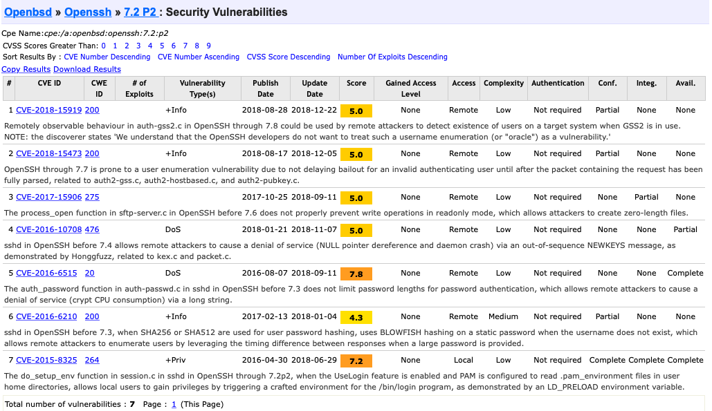
https://www.cvedetails.com/vulnerability-list/vendor_id-97/product_id-585/version_id-194112/Openbsd-Openssh-7.2.html

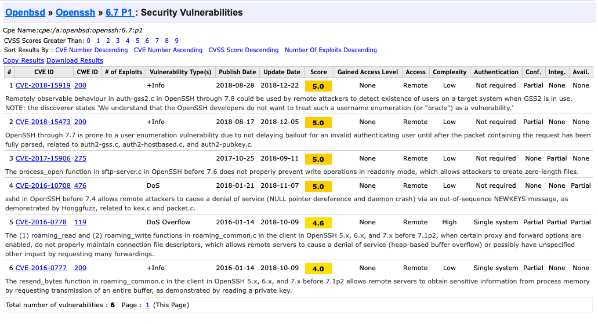
https://www.cvedetails.com/vulnerability-list/vendor_id-97/product_id-585/version_id-188833/Openbsd-Openssh-6.7.html

Com base nos resultados ilustrados pelas duas últimas imagens apresentadas observa-se que a versão OpenSSH 7.2p2 é a que apresenta maior número de vulnerabilidades, 
tendo no total 7 vulnerabilidades, enquanto que a versão OpenSSH 6.7p1 apresenta 6 vulnerabilidades.

De acordo com o *CVSS score* identificado no *CVE details* nota-se que a vulnerabilidade com gravidade mais alta (de valor igual a 7.8) corresponde à vulnerabilidade 
identificada por **CVE-2016-6515**, estando esta associada à versão OpenSSH 7.2p2.

A descrição da vulnerabilidade [CVE-2016-6515](https://nvd.nist.gov/vuln/detail/CVE-2016-651):

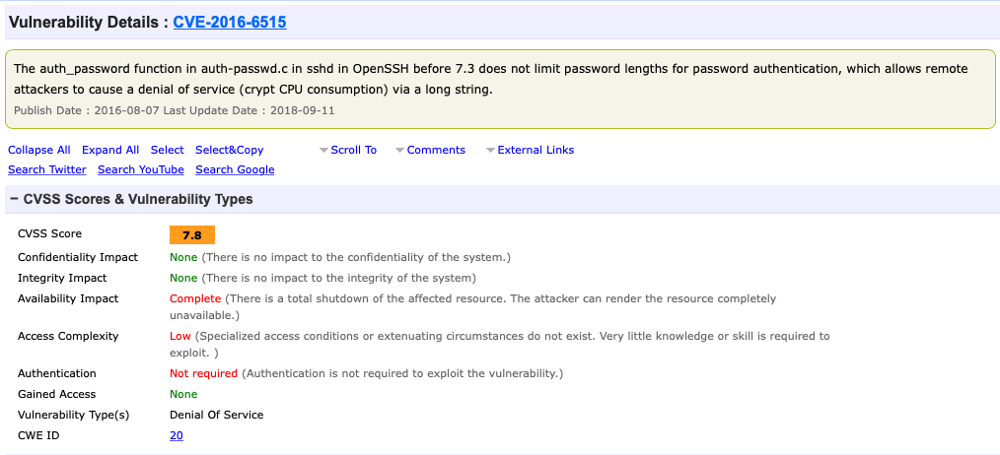
https://www.cvedetails.com/cve/CVE-2016-6515/


permite concluir que a mesma possibilita a realização de um ataque de negação de serviço (*denial of service*) ao não impor qualquer limitação face ao comprimento das
*passwords* utilizadas pelo mecanismos de autenticação resultando numa elevada utilização do CPU e tornando o sistema irresponsivo a outros clientes. 

A baixa complexidade do ataque e o facto de este poder ser realizado remotamente sem exigir autenticação prévia justificam a classificação desta vulnerabilidade como grave.
É no entanto importante realçar que, ainda que não seja trivial, a atualização da versão OpenSSH utilizada apresenta-se como uma solução para a vulnerabilidade apresentada.
