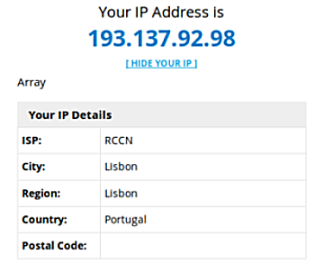
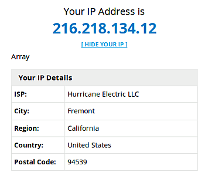
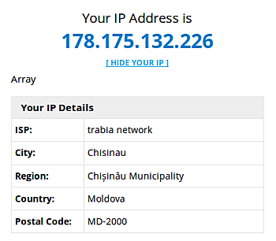
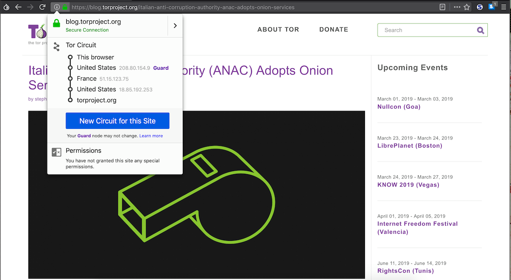
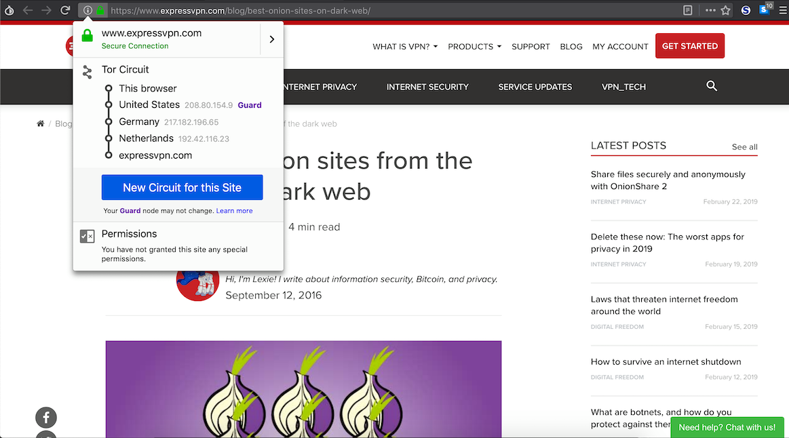
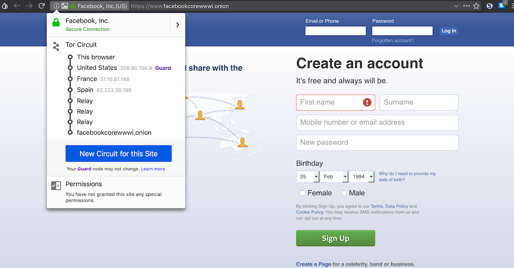

# Aula TP - 25/Fev/2019

## 1\. TOR (The Onion Router)

### Experiência 1.1

A utilização da ferramenta `anonsurf` permite o estabelecimento de uma ligação cifrada e anónima com recurso ao protocolo TOR. Uma das consequências deste protocolo
é a alteração da localização aparente do cliente quando acede a um dado *website*. 

1. Abrindo o browser e acedendo à página <http://myiplocator.net/> é possível observar o IP e localização reais da máquina (neste caso do seu ISP):

2. Após a invocação, na linha de comando, de `sudo anonsurf start`, atualizou-se a página, tendo o cuidado de evitar que fosse apresentada a página guardade em 
*cache*, permite observar a mudança do endereço IP e localização da máquina que efetuou o pedido ao servidor em causa:

3. Executando o comando `sudo anonsurf change` resulta no estabelecimento de um novo circuito TOR que ligue o cliente ao servidor, resultando na alteração, mais uma
vez, do endereço IP e da localização aparentes do cliente:

4. O término da execução do serviço TOR, com recurso ao comando `sudo anonsurf stop`, resulta na alteração do endereço IP e da localização para os valores inicialmente
observados:

### Resposta à Pergunta P1.1

**Para aceder a alguns sites nos EUA tem que estar localizado nos EUA.**

**1. Efetuando o comando `sudo anonsurf start` consegue garantir que está localizado nos EUA?**

O protocolo TOR estabelece o circuito TOR de forma aleatória com base nos OR's (*Onion Routers*) "conhecidos" e como tal, ao executar o comando `sudo anonsurf start`, 
não é possível garantir que se ficará localizado nos EUA **i.e.** que o nodo de saída (*exit node*) se encontra localizado nos EUA. No entanto, existem mecanismos 
disponíveis para que um utilizador especifique qual o país do último nodo. Um destes mecanismos exige acrescentar ao ficheiro **/etc/tor/torrc** a linha 
**ExitNodes {us} StrictNodes 1** e confirmar a alteração, executando novamente o comando `sudo anonsurf start`.

(FONTE: <https://www.torproject.org/docs/faq.html.en#ChooseEntryExit>)

**2. Porquê? Utilize características do protocolo TOR para justificar.**

O protocolo TOR tem como principal objetivo o estabelecimento de ligações anónimas ponto-a-ponto (*peer-to-peer*) tendo como uma das caraterísticas principais
a geração de um circuito **aleatório** que liga o cliente ao servidor que este pretende, por meio de nodos conhecidos como Onion Routers(OR).

O cliente TOR, designado *Onion Proxy* (OP), executa um pedido ao *Directory Server* (DS), um nodo confiável que possui uma lista assinada dos Onion Routers
disponíveis e respetivo estado, que é requisitada periodicamente pelos clientes. Com base nesta lista é gerado, de maneira aleatória, um circuito composto
por 3 nodos que ligam o cliente ao destino, sendo este circuito atualizado periodicamente de 1 em 1 minuto. O cliente estabelece, com os 3 ORs, uma chave simétrica 
com recurso ao protocolo de troca de chaves Diffie-Hellman e às *long-term keys* dos OR's para garantir a autenticadade das mensagens troadas neste protocolo.
Neste processo não existe qualquer ação determinada pelo cliente, não sendo assim possível determinar qual o OR ao qual o este se vai ligar, resultando neste modo 
em localizações de carácter aleatório e fictício.

(FONTE:<https://pt.wikipedia.org/wiki/Tor_(rede_de_anonimato)>)

### Experiência 1.2

A. Observação do circuito do site <https://blog.torproject.org/italian-anti-corruption-authority-anac-adopts-onion-services>:

B. Observação do circuito do site <https://www.expressvpn.com/blog/best-onion-sites-on-dark-web/>:

### Pergunta P1.2

No seguimento da experiência anterior, acedeu-se a <https://www.facebookcorewwwi.onion/> e verificou-se o circuito para esse site:

**Porque existem 6 "saltos" até ao site Onion, sendo que 3 deles são "_relay_"? Utilize características do protocolo TOR para justificar.**

Uma das funcionalidade do protocolo TOR relaciona-se com a possibilidade de anonimizar serviços **i.e.** o cliente desconhece o servidor
ao qual se quer ligar, conhecendo apenas o seu endereço público. Para conseguir isto é necessário que sejam efetuados 6 saltos, os primeiros 3 (saltos)
correspondem aos OR's obtidos através do *Directory Server* (DS) em que o utilizador se liga, de forma anónima, ao serviço destino; os restantes 3 saltos, *relays*, 
referem-se aos OR's do circuito criado pelo serviço de destino.

Inicialmente o cliente começa por aceder ao DS para obter informação sobre os IP (*Introduction Points*) e a chave pública do serviço anónimo 
ao qual quer aceder, XYZ.onion. Após a escolha dos IP's é criado um circuito TOR até um RP (*Rendezvous Point*), que efetuará a ligação ao nodo que disponibiliza
o serviço (anónimo), fornecendo-lhe um *rendez-vouz cookie* (que permitirá a identificação de forma única do RP ao qual o serviço deve enviar os pacotes que 
requisitou).

Os *Rendezvous Points*, permitem que os utilizadores se liguem aos serviços Onion, anteriormente conhecidos como serviços ocultos, sem que cada um conheça a 
identidade do outro.

O utilizador do serviço abre uma *stream* até um dos IP's do serviço anónimo a quem envia uma mensagem, cifrada com a chave pública do serviço anónimo, com a 
informação sobre o RP, o *rendez-vouz cookie* e a sua parte da chave de sessão, estabelecida através do protocolo *Diffie-Hellman*. O serviço anónimo, para 
responder ao utilizador, constrói um circuito TOR até ao RP do utilizador, enviando uma mensagem com o *rendez-vouz cookie*, a sua parte da chave *Diffie-Hellman* 
e o *hash* da chave partilhada. 

Existe assim, entre o utilizador e o serviço anónimo, um circuito de 6 OR's onde cada uma das partes tem apenas conhecimento de metade do circuito. Desta forma, o 
utilizador do serviço anónimo tem conhecimento dos três OR's até ao RP, ponto a partir do qual os saltos são efetuados por *relay nodes* sobre os quais o utilzador
não dispõe de qualquer informação.

(FONTES:<https://www.torproject.org/docs/onion-services.html.en>, <https://www.torproject.org/about/overview.html.en>)
