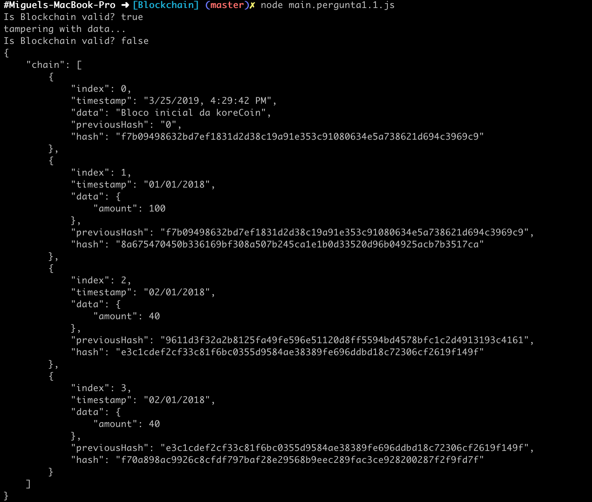
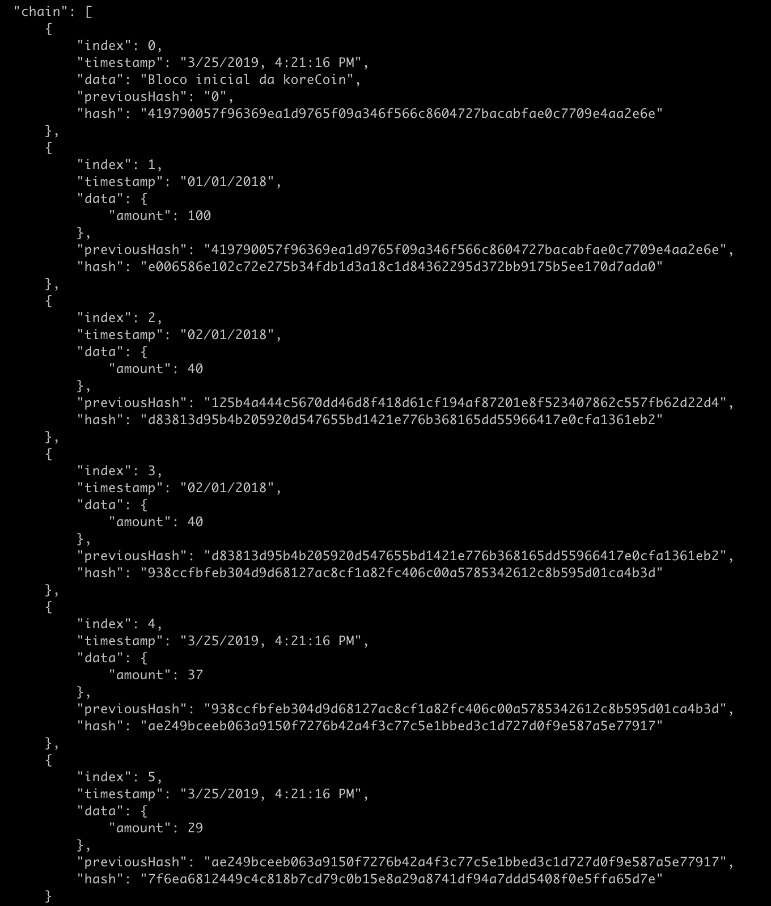
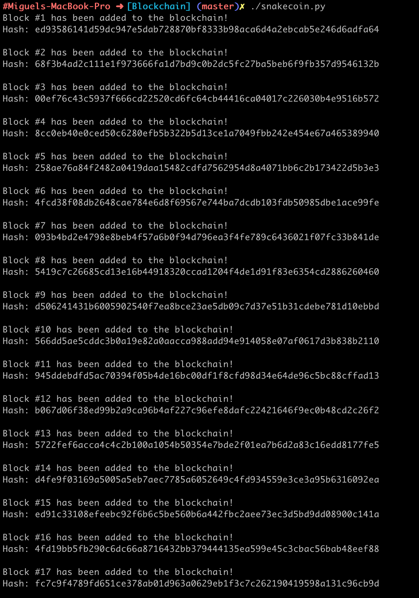
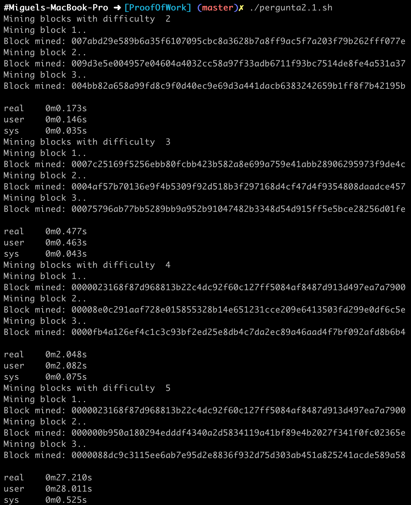
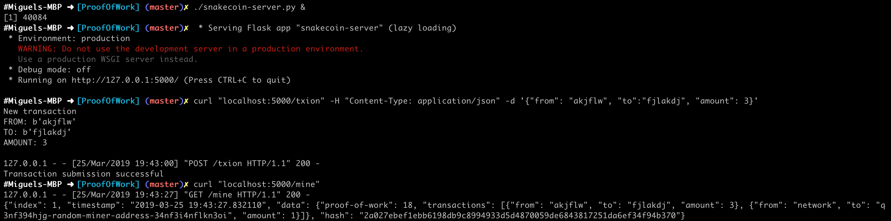

# Aula TP - 25/Mar/2019

## Blockchain


### Pergunta 1.1
O *GenesisBlock* é criado pelo construtor da classe `Blockchain` invocando a função `createGenesisBlock`:
```
return new Block(0, "02/01/2018", "Genesis Block", "0");
```
como tal, para alterar o *timestamp* e dados incluídos neste block basta alterar o segundo e terceiro
parametros respetivamente. Para obter o *timestamp* atual basta recorrer à classe `Date` e formatar a data
atual segundo o formato **UTC**:
```
var now_s = new Date(Date.now()).toLocaleString(); // get current timestamp and convert to UTC format
return new Block(0, now_s, "Bloco inicial da koreCoin", "0");
```

que resulta na mudança do *timestamp* e dados associados ao primeiro bloco:


### Pergunta 1.2

A adição de blocos é possível com recurso ao método `addBlock`, como tal é possível adicionar dois blocos
com quantias aleatórias (entre 0 e 100) e *timestamps* correspondentes ao instante de criação da seguinte
maneira:

```
koreCoin.addBlock(new Block(4, new Date(Date.now()).toLocaleString(), {amount: Math.floor(Math.random()*100)}));
koreCoin.addBlock(new Block(5, new Date(Date.now()).toLocaleString(), {amount: Math.floor(Math.random()*100)}));
```

que pode ser verificada imprimindo a *chain*:



### Experiência 1.2
Executando o [*script* Python](Blockchain/snakecoin.py) é possível observar uma implementação equivalente à anterior
de uma *blockchain*:




## Proof of Work
*Proof of work* é um mecanismo que permite resolver diversos problemas associados à criação e adição de novos blocos
numa *blockchain*. Para tal é necessário resolver um problema matemático (puzzle) que consiste em calcular um valor
(normalmente um *hash*) pre-determinado para ser autorizado a adicionar um dado bloco (conjunto de transações) na
cadeia. Este problema é elaborado de maneira a que necessite, em média, de 10 minutos para ser resolvido, variando
de complexidade consoante o número de nodos/mineiros na rede.

### Experiência 2.1
O puzzle que será desenvolvido requer que os nodos calculem um *hash* com um prefixo de N zeros, com N um valor predefinido.
A dificuldade deste puzzle está diretamente relacionada N, sendo tanto maior quanto o valor deste.


### Pergunta 2.1
Por forma a automatizar a realização desta pergunta o código da experiência foi [modificado](ProofOfWork/main.pergunta2.1.js) 
para receber a dificuldade do puzzle como argumento da linha de comandos:

```
// Get PoW difficulty as a command line argument
difficulty = Number(process.argv[2])

let koreCoin = new Blockchain(difficulty);
```
tendo sido desenvolvido um [*script*](ProofOfWork/pergunta2.1.sh) que permite automatizar o processo de teste do tempo
de execução para cada um dos valores de dificuldade.
Como se pode observar:



o tempo aumenta em função da dificuldade do puzzle. Isto deve-se ao facto de o número de soluções para este serem inferiores,
levando a que seja necessário efetuar um maior número de tentativas para encontrar um valor de *hash* que respeita as condições
impostas **i.e.** com o número de zeros correspondente à dificuldade do problema. 

### Experiência 2.2



### Pergunta 2.2
O algoritmo computacional de *Proof of Work* corresponde ao cálculo do mínimo múltiplo comum entre a solução do último *Proof of Work* 
e 9: `incrementor % 9 == 0 and incrementor % last_proof == 0`. Dado a complexidade deste algoritmo, que é linear em relação à última
solução (O(N)), este não é adequado para a utilização em *mining* dado ser de fácil resolução, não apresentado um custo computacional
elevado exigido por este protocolos.
