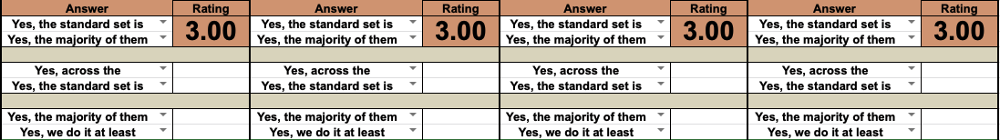
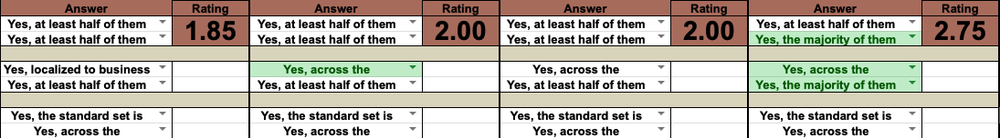

# TP - 08/Abr/2019

## P1.1 - Risco

Considerando a fórmula de risco apresentada, é possível identificar dois fatores que condicionam de totalmente o risco existente:
1. **probabilidade de sucesso de um ataque**
1. **impacto** do ataque

Consideremos primeiro o **impacto** de um ataque a um servidor de *homebanking*, de imediato é possível concluir que este será superior ao **impacto**
de um ataque a um PC doméstico dado que o primeiro contempla um maior número de utilizadores e é afeto a um conjunto de dados sensíveis, nomeadamente
dados bancários como credenciais, histórico de transferências, balanços de contas, etc.

Por outro lado, uma análise quanto à **probabilidade de sucesso de um ataque** exige que sejam considerados o **nível de ameaça** e o **grau de
vulnerabilidade**. Quanto ao primeiro fator será natural considerar que este será superior no caso de um servidor de *homebanking* dado o valor
superior inerente ao mesmo quando comparado com um PC doméstico que, apesar de poder conter dados sensíveis, representa um alvo menos valioso.  No
entanto, dados os requisitos de segurança de um servidor de *homebanking*, o **grau de vulnerabilidade** do mesmo será inferior ao de um PC doméstico
que, de uma maneira geral, estará mais desprotegido, dado haver um incentivo menor de garantir que dados sensíveis não são comprometidos.

Como tal, e tendo em conta o que foi anteriormente referido, conclui-se que um servidor de *homebanking* está sujeito a um maior risco na *Internet*.

## P2.1 - Microsoft S-SDLC

O ciclo de desenvolvimento de *software* da Microsoft é constituído pelas seguintes fases:
1. (Pré)Fase de formação
1. Fase de Requisitos
1. Fase de Desenho
1. Fase de Implementação
1. Fase de Verificação
1. Fase de Publicação
1. Fase de Resposta

sendo que a fase que contempla o cumprimento do Regulamento Geral de Proteção de Dados (RGPD) corresponde à fase de requisitos em que são tidas em
conta normas e recomendações internacionais para definir os requisitos mínimos de segurança para um dado projeto.

## P2.2 - [ISO / IEC 27002: 2013](http://www.smartassessor.com/Uploaded/1/Documents/ISO-2017-standard.pdf)

### Política de desenvolvimento seguro

Motivação: regras e regulamentos devem ser aplicados aos processos de desenvolvimento dentro da organização desenvolvimento seguro é necessário para
produzir serviços, arquiteturas e sistemas seguros

Aspetos: segurança do ambiente de desenvolvimento regulamentos/guias de programação segura, contemplando segurança no processo de desenvolvimento
checkpoints para verificação da segurança num determinado produto segurança nos sistemas de controlo de versões conhecimento de práticas de
desenvolvimento seguro e de correção/mitigação de vulnerabilidades

Deve contemplar técnicas de programação segura que devem ser colocadas em vigor não só no desenvolvimento de raiz mas também na reutilização de
código.

### Controlo de mudanças ao nível do sistema

Devem ser implementados mecanismos que especifiquem, formalmente, a introdução, remoção, alteração de sistemas, garantindo a documentação,
especificação e controlo de qualidade dos mesmos. Adicionalmente qualquer modificação ao sistema deve garantir que as restrições anterioremente
impostas continuam a ser cumpridas e que os utilizadores do mesmo não têm acesso a informação não essencial ao desempenho das suas funções.

Atualizações automáticas e outras práticas que favoreçam qualidade de utilizador devem ser consideradas face ao risco que representam relativamente à
integridade e disponibilidade de um dado sistema.

### Mudanças nas plataformas operacionais

Mudanças em plataformas operacionais devem se precedidas de um processo que garanta que os mecanismos de controlo e integridade das aplicações
críticas para o funcionamento do sistema não são comprometidas. Como tal é necessário que as mudanças sejam comunicadas atempadamente por forma a
permitir que estes procedimentos sejam levados a cabo.

### Modificações aos pacotes de software utilizados

A modifcação de ferramentas fornecidas por terceiros deve ter em conta o possível impacto nos mecanismos de controlo embutidos nos mesmos. Como tal
devem ser consideradas outras vias de obter a funcionalidade pretendida, quer através de updates ou mesmo através de ferramentas alternativas.  Caso
as modificações sejam levadas a cabo deve ser mantida uma cópia original da ferramenta e deve ser garantida a atualização da mesma.

### Princípios de engenharia de sistemas seguros

Boas práticas de desenvolvimento seguro devem ser documentadas, mantidas e especificadas de maneira clara sendo necessário regulamentar as mesmas de
maneira a que sejam cumpridas nas diversas atividades da empresa. Adicionalmente estas práticas devem ser revistas e atualizadas regularmente para
garantir que se mantêm eficazes.

### Ambiente de desenvolvimento seguro

O ambiente de desenvolvimento deve ser configurado de maneira a garantir que o mesmo é adequado ao desenvolvimento de software seguro. Estes ambiente
inclui funcionários, processos e ferramentas que devem ser avaliadas de acordo com o risco que apresentam e a função que desempenham. Todas as medidas
tomadas neste sentido devem ser documentadas e comunicadas a quem necessitar.

### Desenvolvimento em regime de outsourcing

O desenvolvimento de sistemas em regime *outsourcing* deve ser monitorizado de maneira a garantir que as medidas de segurança são claramente
especificadas e implementadas.  Como tal devem ser elaborados contratos que especifiquem as práticas de desenho, desenvolvimento e teste de sofware
seguro; quais os níveis de qualidade esperados; etc.

### Teste da segurança de sistemas

O desenvolvimento de sistemas de software deve contemplar testes e mecanismos que verifiquem a segurança do mesmo, especificando os comportamentos
esperados face a um conjunto de variáveis de *input*. Estes testes devem ser levados a cabo periodicamente, eventualmente por equipas independentes,
devendo ser adaptados ao projeto a que se referem.

### Testes de aceitação de sistemas

A integração de sistemas deve ser mediada por testes que garantam que os mesmos não violam as práticas de desenvolvimento de seguro ou os regulamentos
de segurança estabelecidos. Esta análise deve ser levada a cabo por ferramentas de análise automáticas em cenários realistas.

### Uso de protocolos criptográficos

O uso de protocolos criptográficos deve ser mediado por um regulamento que especifique quais os algoritmos usados, o contexto em que estes devem ser
usados, que mecanismos devem ser usados na gestão as chaves, qual o impacto da implementação destes protocolos e quais os responsáveis pela mesma.
Adicionalmente estas considerações devem integrar o processo de avaliação de riscos, sendo a escolha de protocolos condicionada pelos objetivos e tipo
de controlo pretendidos.

### Gestão de chaves 

A gestão de chaves criptgráficas deve contemplar não só o seu armazenamento mas também a sua criação, consulta, distribuição,
revogação e destruição.  Esta gestão deve garantir a integridade das chaves e impedir a perda das mesmas e acesso por parte de entidades não
autorizadas.  Como tal devem ser tidos em conta aspetos como:
1. aplicação da chave **i.e.** algoritmos criptográficos e aplicações 
1. distribuição e ativação de chaves
1. armazenamento e controlo de acesso a chaves
1. atualização, revogação, recuperação e destruição de chaves
1. monitorização e registo de ações que envolvam o uso de chaves

Para prevenir o uso indevido de chave devem ser atribuídos tempos de validade a cada uma das chaves. Por outro lado é importante garantir a
autenticidade das chaves públicas atraés de certificados de chave pública emitidos por uma **CA**(*Certificate Authority*) de confiança.

---------------------------------------------------------------------------------------------------------------------------------------------------

Como é possível observar muitos dos controlos anteriormente especificados regulam o funcionamento do sistema de desenvolvimento de software, não
tendo como foco o produto do mesmo. Isto é motivado pelo facto de que este componente (sistema de desenvolvimento) corresponde a um ponto de falha
central que, ao ser comprometido, põe em causa a segurança dos produtos desenvolvidos. Como tal, e tendo como exemplo o desenvolvimento do
componente de assinaturas PAdES em *Javascript*, é importante considerar não só os protocolos criptográficos usados na assinatura dos PDF's
mas também garantir que as *frameworks* usadas para implementar as funcionalidades criptográficas e de tratamento de documentos PDF cumprem os
requisitos de segurança estabelecidos. Adicionalmente, e no que diz respeito às chaves privadas usadas para assinar os PDFs, deve ser usados mecanismos
que permitam a sua manipulação de maneira a garantir que não ocorrem fugas de informação que ponham em causa as mesmas.

## P3.1 - SAMM Assess Phase
Tendo por base os dados presentes na *sheet "Interview"* salientam-se, de seguida, três práticas de segurança e a sua maturidade, levadas a cabo na realização
do projeto de Engenharia de Segurança:
1. **Secure Architecture**: nível de maturidade 3
1. **Implementation Review**: nível de maturidade 2.60 
1. **Environment Hardening**: nível de maturidade 1.85

## P3.2 - SAMM Set The Target Phase
As metas relativas ao nível de maturidade para cada uma das práticas de segurança encontram-se apresentadas de seguida:
1. **Secure Architecture**: nível de maturidade pretendido 3; manter o nível de maturidade
1. **Implementation Review**: nível de maturidade pretendido 2.75; aumentar o nível de maturidade na 3º fase do ciclo de desenvolvimento ao garantir que pelo menos metade 
dos *stakeholders* participam no processo de avaliação de código ao rever os resultados deste processo
1. **Environment Hardening**: nível de maturidade pretentido 2.75;
    1. na 2º fase do ciclo de desenvolvimento pretende-se garantir que é definido um mecanismo de atualização de sistemas e aplicação de *patches* referentes a dependências consideradas críticas
    1. na 4º fase do ciclo de desenvolvimento pretende-se garantir que: 
        - a maioria dos projetos possuem as atualizações de segurança mais recentes de ferramentas de terceiros
        - o mecanismos de atualização desenvolvido na 2º fase é implementado por todas as equipas da organização
        - a maioria dos projetos implementam mecanismos de verificação do estado de segurança e qualidade do ambiente de desenvolvimento

## P3.3 - SAMM Define The Plan Phase
1. **Secure Architecture**:

1. **Implementation Review**:

1. **Environment Hardening**:

[Ficheiro excel com metas pretendidas](SAMM_Assessment_Toolbox.xlsx)
