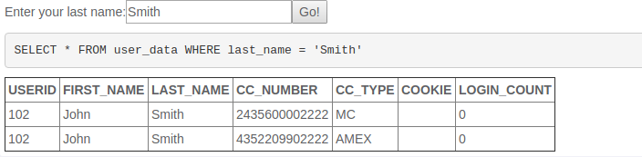
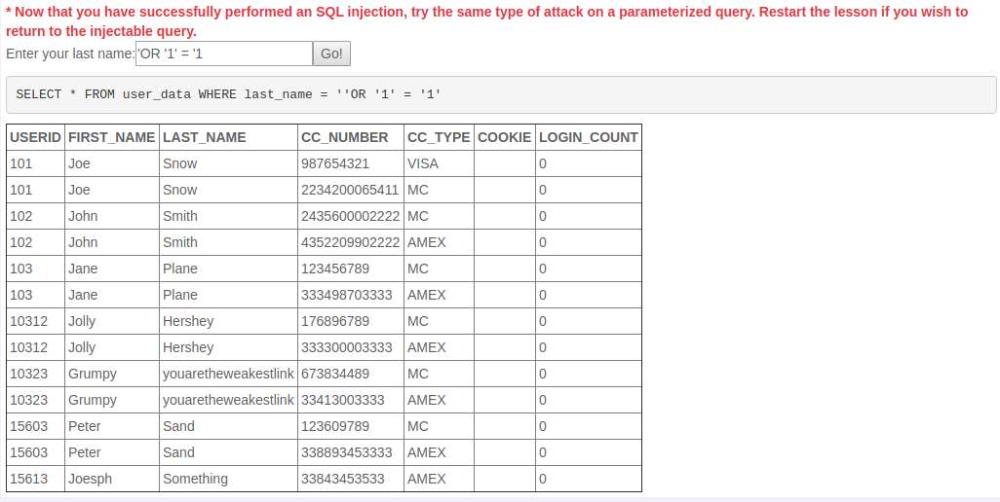
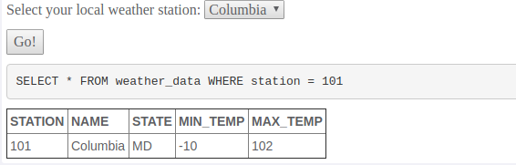
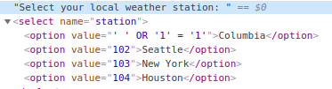
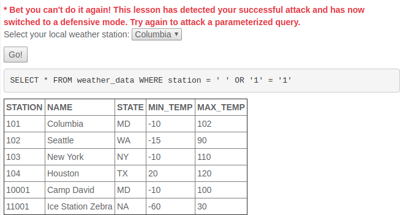
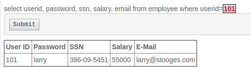
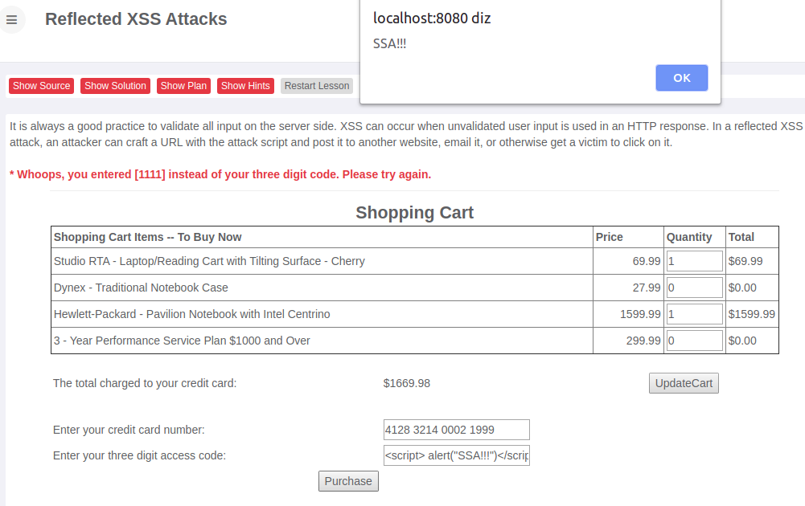
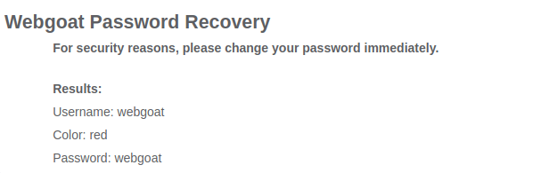
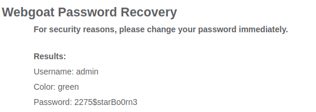

# Pergunta 1

## Pergunta 1.1 - String SQL Injection

1. O comportamento normal a quando da inserção de um nome vulgar é o esperado uma vez que mostra os cartões de créditos pertencentes à pessoa cujo **last_name** foi inserido.



2. Como a validação do *input* não é verificada, é possível permitir que uma *query* faça match com todos os utilizadores, dá-se a este acontecimento o nome de tautologia. A figura abaixo mostra o resultado obtido



## Pergunta 1.2 - Numeric SQL Injection

1. Aquando da utilização normal, como será demonstrado na figura abaixo é possível verificar que cada estação é traduzido para um número que é colocado no código *sql*, pelo que não é possível aterar a *query* através do input colcoado, como se verificava na questão anterior.



2. Acedendo às ferramentas do próprio browser que se está a utilizar é possível ter acesso ao **HTML** da página, podemos alterar o valor ```value``` da opção Columbia, por exemplo, tal como apresentado em baixo, sendo o resultado vísivel na segunda imagem.





## Pergunta 1.3 - Database Backdoors

1. Aquando da utilização normal da *query sql* é possível verificar que ao inserir o ```ID=101```, mostra alguns dados da pessoa que é identificada com esse ```ID```.



2. Para explorar a vulnerabilidade para atlerar o salário para um valor mais alterado foi inserido como input ```101; UPDATE employee SET salary=75000 WHERE userid=101``` e como tal o valor do salário foi alterado como pode ser verficado na imagem abaixo.


# Pergunta 2

## Pergunta 2.1 - Reflected XSS

1. Neste tipo de situações pode-se colocar caracteres pouco usuais no campo dos inputs de modo a testar que tipo de validações são feitas em cada caso específico.

3. Após vários testes nos vários inputs, reconhecemos que o único campo que pode ser suscetível a este tipo de ataque é o campo onde se digita o código do cartão de crédito. O resultado encontra-se em na figura abaixo, sendo este um ponto vulnerável quando é introduzido o respetivo input.



# Pergunta 3

## Pergunta 3.1 - Forgot Password

1. Para o utilizador *webgoat* e para a questão pessoal respondida foi econtrado o seguinte resultado.



2.  O utilizador do sistema que mais seria interessante saber as informações seria a do *admin* do sistema. Posto isto apoós varias tentativas de modo a obter a respota à questão apresentada, conseguimos obter o tal acesso pretendido como será apresentado na imagem abaixo.



3. Tal como na questão acima foi mencionada seria possível um ataque à força bruta, pois não foram precisas muitas tentativas de modo a descobrir o pretendido.