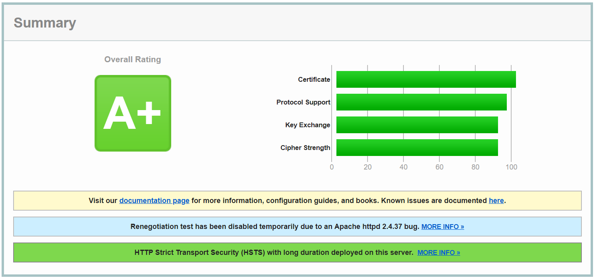
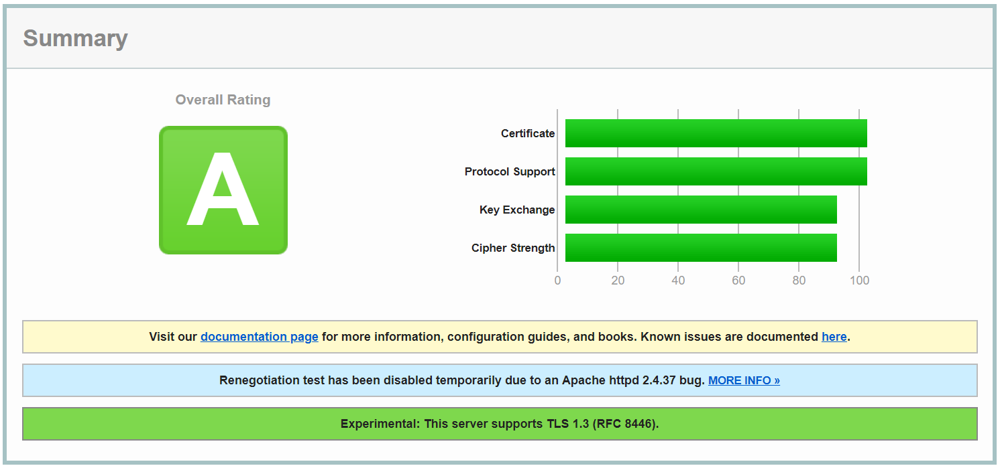
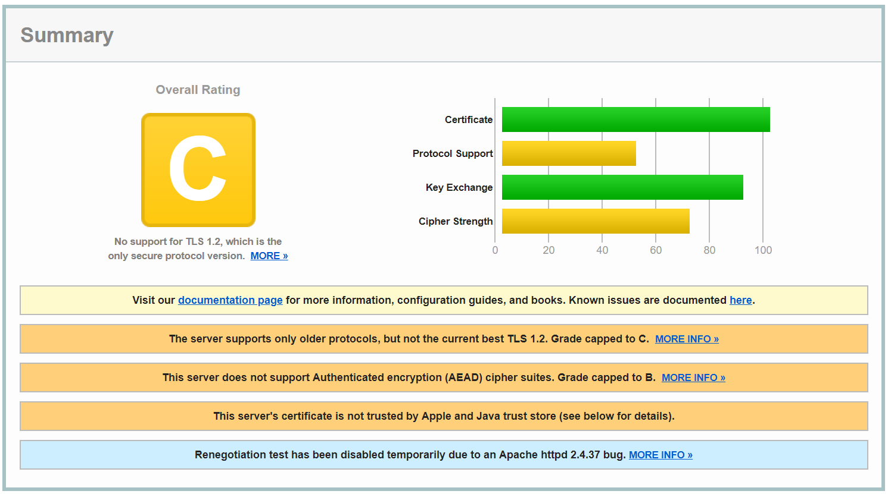

# Trabalho Prático 2 - 18/Fev/2019

## 1. Assinaturas cegas (Blind signatures) baseadas no Elliptic Curve Discrete Logarithm Problem (ECDLP)

### Pergunta P1.1

O código alterado referente a esta questão encontra-se nos documentos indicados de seguida:

* [init-app.py](./BlindSignature/init-app.py)
* [ofusca-app.py](./BlindSignature/ofusca-app.py)
* [blindSignature-app.py](./BlindSignature/blindSignature-app.py)
* [desofusca-app.py](./BlindSignature/desofusca-app.py)
* [verify-app.py](./BlindSignature/verify-app.py)


## 2. Protocolo SSL/TLS

### Pergunta P2.1 - i

Optou-se por efetuar o *SSL Server test* nos *websites* dos Ministérios de Governos Europeus, não portugueses, apresentados de seguida:

* [Ministério da educação, Alemanha](https://www.bmbf.de/en/index.html)
    * [*SSL Labs*](https://www.ssllabs.com/ssltest/analyze.html?d=www.bmbf.de)
    * [PDF](./Images/P2_Alemanha_educacao.pdf)
    * Resumo do *SSL Server test*: 
* [Ministério da defesa, França](https://www.defense.gouv.fr/english/portail-defense)
    * [*SSL Labs*](https://www.ssllabs.com/ssltest/analyze.html?d=www.defense.gouv.fr)
    * [PDF](./Images/P2_Franca_defesa.pdf)
    * Resumo do *SSL Server test*: 
* [Ministério da saúde, Espanha](https://www.mscbs.gob.es/)
    * [*SSL Labs*](https://www.ssllabs.com/ssltest/analyze.html?d=www.mscbs.gob.es)
    * [PDF](./Images/P2_Espanha_saude.pdf)
    * Resumo do *SSL Server test*: 


### Pergunta P2.1 - ii

O *website* escolhido com pior *rating* é o do ministério da saúde, de Espanha, com *rating* C. Os fatores que mais contribuem para esta classificação são os seguintes:

* o certificado do servidor não é confiado pelas *trust store* da Apple e do Java;
* o servidor não suporta cifras com *authenticated encryption with associated data* (AEAD) - *rating* diminui para B;
* o servidor apenas suporta protocolos antigos e não o melhor atualmente (TLS 1.2) - *rating* diminui para C.

Note-se ainda que, das 5 cifras disponíveis, 3 são consideradas fracas. Para além disso, o campo `Session resumption (caching)` também é realçado a laranja. Contudo, este não afeta o *rating* total, ou seja, a segurança do *website*, mas apenas o desempenho do mesmo ([*fonte*](https://github.com/ssllabs/ssllabs-scan/issues/464)).

Assim, apesar de ter um *rating* C, considerado médio, não foi detetada nenhuma vulnerabilidade que pudesse ser explorada. De facto, embora só se tenha disponível o TLS 1.1 ou inferior, este não oferece risco de segurança imediato, pois não se conhece nenhum ataque que consiga quebrar esta versão do TLS ([*fonte*](https://security.stackexchange.com/questions/57878/what-are-the-main-vulnerabilities-of-tls-v1-1)). No entanto, seria prudente oferecer a possibilidade de utilização das versões mais recentes do TLS (1.2 e 1.3), que não dependem dos algoritmos MD5 e SHA-1, que já foram quebrados, e permitem a utilização de AEAD.

A utilização de *Authenticated Encryption* é útil devido ao facto de, sem a mesma, a combinação segura de modos de operação de cifras por blocos, que oferecem confidencialidade e autenticação separadamente, ser difícil e propensa a erros. A falta de autenticação pode permitir a realização de ataques, como, por exemplo, ataques de criptograma escolhido.

### Pergunta P2.1 - iii

O TLS 1.0 e versões anteriores apresentam uma falha grave, que se centra no facto do vetor de inicialização (IV), que é utilizado para esconder dados (*plaintext*) antes de uma operação de cifra (por blocos), corresponder ao último bloco cifrado na operação anterior. Este facto faz com que o IV possa ser previsto por um atacante ativo (*man-in-the-middle*), através de um ataque de texto limpo escolhido.

O ataque BEAST (*Browser Exploit Against SSL/TLS*) consiste na aplicação desse ataque, num contexto *Web*, e pode ser utilizado para recuperar pequenos fragmentos de dados, como *cookies* de sessões HTTP, credenciais de autenticação, *tokens* de sessão baseados em URL, entre outros. Assim, este tipo de ataque pode ser considerado um problema sério.

Esta é uma vulnerabilidade do lado do cliente e, desde que foi tornada pública, a maioria dos *browsers* resolvem-na utilizando uma técnica denominada *1/n-1 split*. Esta técnica divide a mensagem a enviar em duas, uma contendo apenas `1` *byte* de *plaintext* e a segunda contendo o resto (`n-1` *bytes*). Esta divisão impede o ataque porque a mensagem com `1` *byte* inclui um valor de MAC, que o atacante não pode prever, sendo também cifrada. Quando o invasor escolhe os dados a cifrar, nem o criptograma de `1` *byte* nem o de `n-1` *bytes* foram emitidos, sendo apenas computados e enviados quando o atacante tiver submetido todos os seus `n` *bytes*. Assim, o atacante não conhecerá o IV da mensagem com `n-1` *bytes* antes de enviar os seus `n` *bytes* para cifrar, sendo apenas capaz de prever o IV para a mensagem com `1` *byte*, o que não é suficiente para realizar um ataque BEAST. ([*fonte*](https://security.stackexchange.com/questions/63215/why-does-firefox-split-https-request))

No resultado do teste sobre o *website* do ministério da saúde, de Espanha, o campo `BEAST attack` tem o valor "Not mitigated server-side ([more info](https://blog.qualys.com/ssllabs/2013/09/10/is-beast-still-a-threat?_ga=2.218543837.515050180.1550781954-879067696.1550781954))   TLS 1.0: 0xc013". Este critério deixou de penalizar o *rating* geral do servidor desde 2013, pois considera-se que, atualmente, este ataque é suficientemente mitigado do lado do cliente.


## 3. Protocolo SSH

### Pergunta P3.1 - 1

Os dois servidores ssh de empresas comerciais no Porto escolhidos foram os seguintes:

- [INESC Porto](https://www.shodan.io/host/194.117.28.57)
	- [SSH-AUDIT *output*](./inesctec.txt)
- [Vodafone](https://www.shodan.io/host/213.30.17.108)
	- [SSH-AUDIT *output*](./vodafone.txt)


### Pergunta P3.1 - 2

Através do *output* do `ssh-audit`, apresentado de seguida, percebeu-se que o servidor utilizado pelo INESC utiliza o sistema operativo `Ubuntu-4ubuntu0.2` e utiliza o protocolo `SSH 2.0` implementado pelo *software* `OpenSSH 7.6p1`, sendo compatível com versões superiores ou iguais a 7.2 e ainda com as versões superiores ou iguais a `2013.62` do `Dropbear SSH`.

**INESC**
```
# general
(gen) banner: SSH-2.0-OpenSSH_7.6p1 Ubuntu-4ubuntu0.2
(gen) software: OpenSSH 7.6p1
(gen) compatibility: OpenSSH 7.2+ (some functionality from 6.6), Dropbear SSH 2013.62+
(gen) compression: enabled (zlib@openssh.com)
```

Além disso, uma análise do *output* do `ssh-audit` para um servidor usado pela empresa Vodafone, apresentado de seguida, percebeu-se que é utilizado o sistema operativo `Debian-6+squeeze3` e utiliza o protocolo `SSH 2.0` implementado pelo *software* `OpenSSH 5.5p1`, sendo compatível com as versões entre 4.7 e 6.6 e ainda com as versões superiores ou iguais a `0.53` do `Dropbear SSH`.

**Vodafone**
```
# general
(gen) banner: SSH-2.0-OpenSSH_5.5p1 Debian-6+squeeze3
(gen) software: OpenSSH 5.5p1
(gen) compatibility: OpenSSH 4.7-6.6, Dropbear SSH 0.53+ (some functionality from 0.52)
(gen) compression: enabled (zlib@openssh.com)
```

### Pergunta P3.1 - 3

Utilizando como base as versões do *software* previamente indicadas encontraram-se as seguintes vulnerabilidades:

- **INESC**
	- [Shodan Website](https://www.shodan.io/host/194.117.28.57) ([PNG](./Images/P3_INESC.png)) -> 0 vulnerabilidades
	- [CVE Details - Ubuntu 18.04](https://www.cvedetails.com/version-search.php?vendor=Ubuntu&product=Ubuntu&version=) ([PNG](./Images/P3_ubuntu1804.png)) -> 0 vulnerabilidades
	- [CVE Details - OpenSSH 7.6p1](https://www.cvedetails.com/vulnerability-list/vendor_id-97/product_id-585/version_id-259116/) ([PNG](./Images/P3_openssh76p1.png)) -> 2 vulnerabilidades

- **Vodafone**
	- [Shodan Website](https://www.shodan.io/host/213.30.17.108) ([PNG](./Images/P3_Vodafane.png)) -> 27 vulnerabilidades
	- [CVE Details - Debian 6.0.3](https://www.cvedetails.com/version-search.php?vendor=Debian&product=Debian+Linux&version=6.0.3) ([PNG](./Images/P3_debian603.png)) -> 0 vulnerabilidades
	- [CVE Details - OpenSSH 5.5p1](https://www.cvedetails.com/vulnerability-list/vendor_id-97/product_id-585/version_id-121221/Openbsd-Openssh-5.5.html) ([PNG](./Images/P3_openssh55.png)) -> 12 vulnerabilidades

Assim sendo, facilmente se percebe que o servidor da Vodafone apresenta, possivelmente, mais vulnerabilidades que o do INESC.

### Pergunta P3.1 - 4

Após analisar todas as vulnerabilidades encontradas anteriormente, a mais grave é a que é identificada pelo `CVE-2011-3192`, com `CVSS Score` de **7.8**.

### Pergunta P3.1 - 5

Para efeitos práticos, a vulnerabilidade indicada no ponto anterior é grave? Porquê?

A vulnerabilidade identificada pelo `CVE-2011-3192` permite que atacantes remotos consigam causar uma negação de serviço (DoS), com base no consumo de memória e CPU excessivo, através de uma implementação errada de um filtro de `byterange`, no Apache HTTP Server (1.3.x, 2.0.x até 2.0.64 e 2.2.x até 2.2.19), que permite que estes possam ser sobrepostos.

Na prática esta vulnerabilidade não compromete a confidencialidade nem a integridade, mas sim a disponibilidade. Salienta-se ainda que a complexidade do ataque não é muito elevada, nem é necessário autenticação para proceder ao mesmo. Para além disso existem *exploits* disponíveis que exploram a vulnerabilidade indicada ([exploit-db - 17696](https://www.exploit-db.com/exploits/17696)).

Esta é uma vulnerabilidade grave, uma vez que compromete a disponibilidade de um servidor *web* (*Apache HTTP Server*), que impossibilita o cumprimento das funções para o qual foi implementado, ficando desta forma obsoleto.
