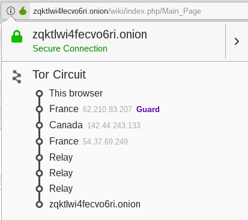
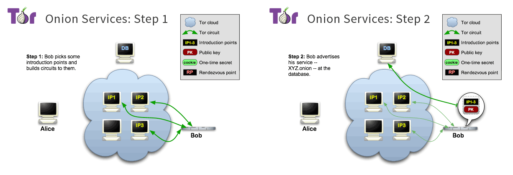
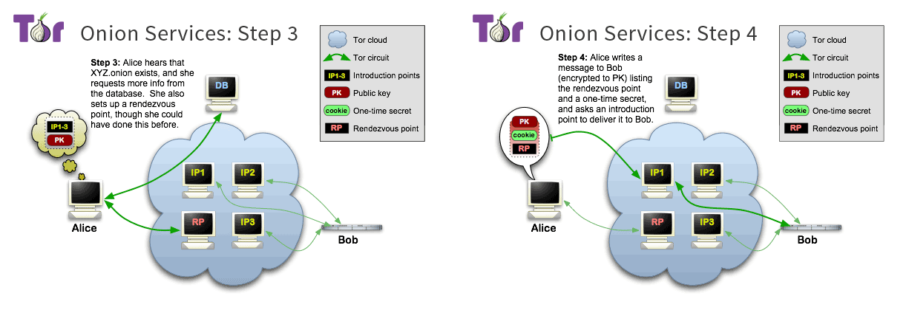
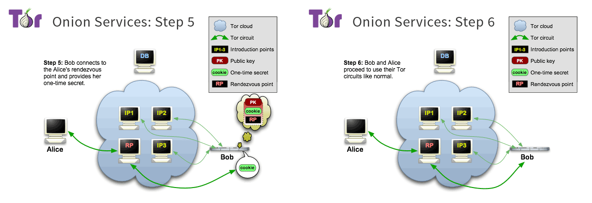

# Trabalho Prático 3 - 25/Fev/2019

## 1. TOR (The Onion Router)

### Pergunta P1.1 - 1/2

Não é possível atribuir ao utilizador uma localização específica (e.g. EUA) através da execução do comando `sudo anonsurf start`. Isto acontece porque, apesar de ser o *Onion Proxy* (OP) que estabelece o circuito através da rede TOR (com base nos dados obtidos do *Directory Server*), este processo é executado de forma aleatória e independente do utilizador. Desta forma, a localização dos vários *Onion Routers* (OR) do circuito não é determinada diretamente pelo utilizador, em particular, o nodo de saída. Este nodo é considerado pelo *website* como sendo o cliente, pelo que só o seu IP e localização são conhecidos. Para todos os efeitos, o servidor *web* considera que estas informações são as do cliente original.

### Pergunta P1.2 - 1

	

Conforme se pode verificar através da imagem anterior, o circuito TOR é constituído por seis OR's, localizando-se os primeiros três em França, Canadá e França, respetivamente, e três OR's de *relay*.

### Pergunta P1.2 - 2

A existência dos 6 saltos deve-se à utilização de um serviço anónimo por parte do website [The Hidden Wiki](http://zqktlwi4fecvo6ri.onion/wiki/index.php/Main_Page).

Primeiramente, para providenciar um serviço anónimo a entidade responsável necessita de informar o *Directory Server* (DS) da existência do serviço. Para isso é comunicada a chave pública associada ao *website*, bem como os *introduction points* (IP) a partir dos quais os futuros clientes terão de passar para aceder ao *website*. Após esta fase de estabelecimento das conexões obtêm-se circuitos TOR para cada um dos IP, que ficam à espera dos pedidos dos clientes.

	

A partir deste ponto o serviço encontra-se pronto a ser acedido. Posteriormente, para que um utilizador tome conhecimento do mesmo tem que consultar (através de um circuito TOR) os detalhes do serviço que se encontram no DS (chave pública e pontos de introdução). Paralelamente, é escolhido um OR para ser o *rendezvous point* (RP) da ligação que se quer estabelecer. De seguida, é gerada uma mensagem constituída por um *rendezvous cookie* (segredo aleatório único), a primeira parte (gx) do protocolo Diffie-Hellman e a informação relativa ao RP, que é cifrada com a chave pública do servidor *web*. Esta mensagem é enviado para um IP, que a reencaminha para o servidor *web* através do circuito TOR. Dada a forma como a mensagem foi cifrada, apenas o destinatário final (*website*) pode aceder ao seu conteúdo.

	

O servidor *web* recebe o pedido de conexão por parte do utilizador, decifra o conteúdo da mensagem, consulta a informação referente ao RP escolhido pelo utilizador e cria um circuito TOR até este. De seguida, envia através deste circuito o *rendezvous cookie*, a segunda parte (gy) do protocolo Diffie-Hellman e um *hash* da chave de sessão. Neste momento encontra-se estabelecido um circuito entre o utilizador e o servidor *web*, constituído por 6 OR. Os três primeiros são resultado do circuito criado entre o utilizador e o RP (inclusive), enquanto que os restantes correspondem ao circuito TOR que foi estabelecido entre o servidor *web* e o RP (exclusive).

	

De realçar que na lista mencionada na pergunta 1.2.1 apenas se encontra disponível informação relacionada com os primeiros 3 OR's, enquanto que os restantes aparecem apenas como *relays*. De facto, apenas é possível escolher um dado OR caso se possua informação sobre o mesmo (endereço de IP, localização, entre outros), pelo que só os dados dos 3 primeiros OR's foram apresentados ao utilizador. Consequentemente, os 3 últimos OR's são apresentados como *relays*, uma vez que não foram escolhidos pelo utilizador e, como tal, este não possui as respetivas informações. Concluindo, o único ponto de conhecimento comum na *stream* anónima é o RP.
