# Trabalho Prático 9 - 06/Mai/2019

## 1. *Injection*

### Pergunta 1.1 - *String* SQL *Injection*

Exemplos de utilização normal:

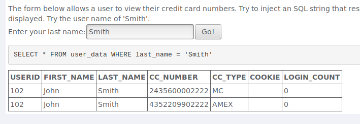

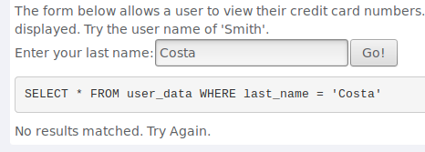

---

Possível solução para executar o SQL *injection*:

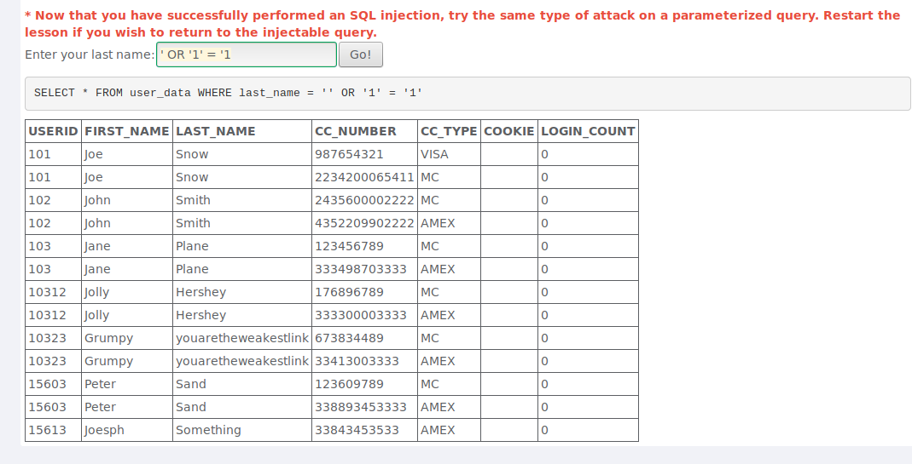

### Pergunta 1.2 - *Numeric* SQL *Injection*

Exemplo de utilização normal:

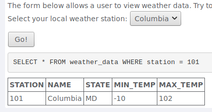

---

Neste exercício em específico, como se trata de um `form` não é possível através da interface manipular os dados que são submetidos. No entanto, utilizando as ferramentas do próprio *browser* é possível ter acesso ao HTML da página. De seguida, basta modificar o campo `value` de uma das opções disponíveis no *dropdown* (e.g. *Columbia*). Na prática, quando selecionamos uma opção é o valor que está no `value` que é submetido, logo se o modificarmos para o valor `'' or '1'='1'` a condição `WHERE` torna-se uma tautologia.

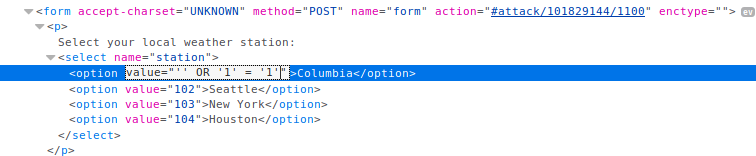

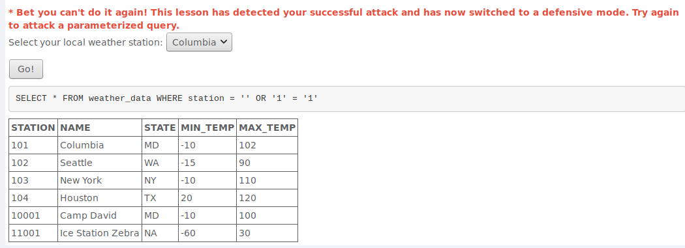

### Pergunta 1.3 - *Database Backdoors*

Exemplo de utilização normal:

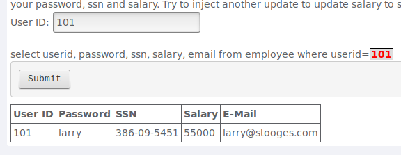

---

Utilizando o comando `UPDATE` do SQL é possível alterar o valor do salário para um número arbitrário. Na prática foi introduzido o seguinte *input*: `101'; UPDATE employee SET salary = '1000000' WHERE userid = 101`.

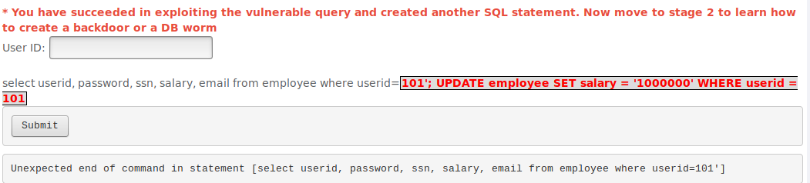

A submissão da *string* anterior faz com que o salário do utilizador com o ID 101 seja 1000000.

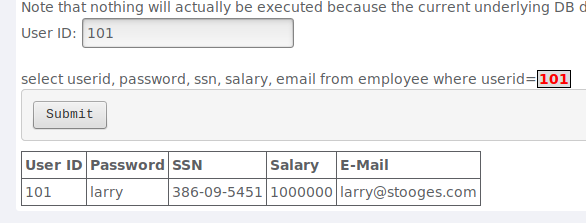

## 2. XSS

### Pergunta 2.1 - *Reflected* XSS

Neste exercício, conseguiu-se refletir o *input* do utilizador através da inserção de quatro números na área de código de acesso de três dígitos. Conforme se pode verificar na seguinte imagem, esta ação resulta na impressão de uma mensagem de erro, que inclui o texto inserido.

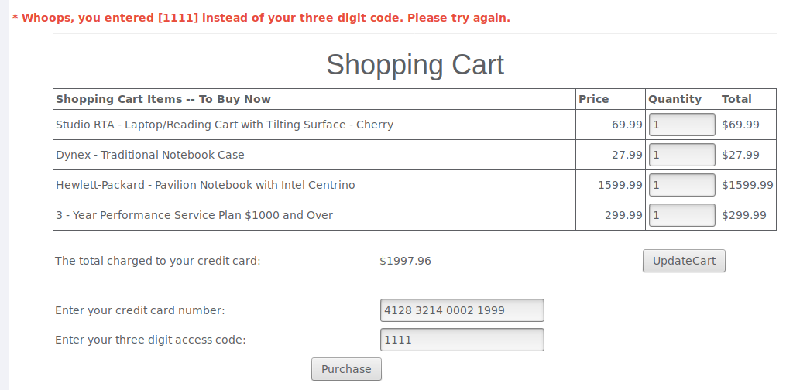

Foram testados todos os campos de *input* de modo a determinar possíveis vulnerabilidades do *website* que permitissem ataques de XSS. Verificou-se que existe validação de *input* nos campos associados às quantidades, sendo substituídos os símbolos `<`, `>`, `'` e `"` por `.`. Para estes, torna-se inviável a injeção de *scripts*. Quanto ao campo de inserção do número de cartão de crédito, apesar de não ser validado o respetivo *input* (o que poderia representar uma vulnerabilidade para um caso de leitura, que não é abrangido pela pergunta), este valor não é retornado para a página. Desta forma, não causa nenhum efeito negativo sobre o sistema.

Ao contrário destes, o campo de código de acesso de três dígitos, para além de não ter qualquer mecanismo de segurança associado, também é devolvido à página, sob a forma de mensagem erro, quando a lógica do programa o dá como inválido. Deste modo, torna-se possível injetar o programa com código *JavaScript* através de uma *tag* HTML *script*, cujo efeito pode ser observado na imagem que se segue:

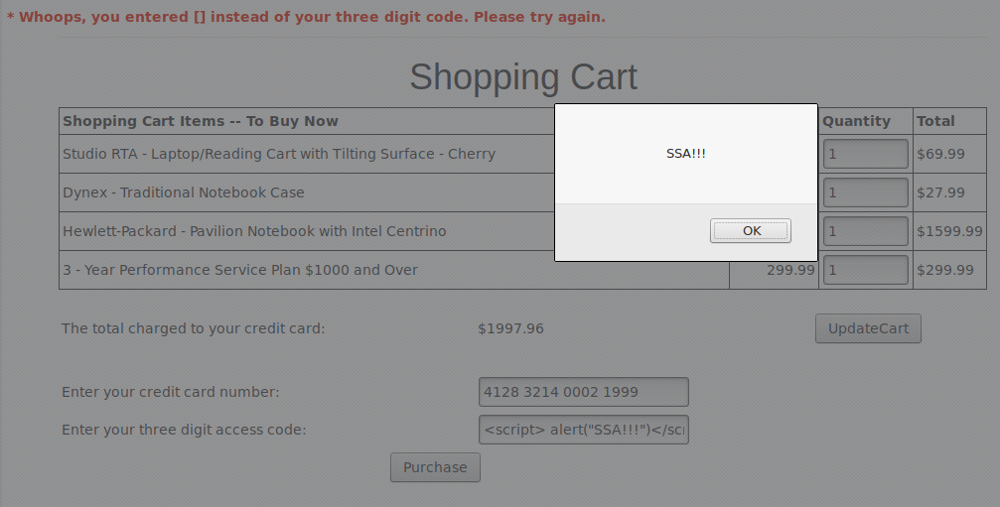

A partir deste exemplo, é potencialmente viável captar qualquer outro dado da página e enviá-lo para o exterior. A título ilustrativo, enviou-se o número do cartão de crédito para o ecrã através de um alerta (``):

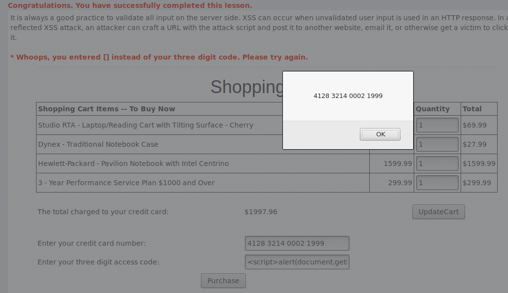

## 3. Quebra na Autenticação

### Pergunta 3.1 - *Forgot Password*

Para este exercício, aplicaram-se métodos dedutivos e tentativas de acesso por força bruta de modo a obter a palavra-passe de um utilizador que não o `webgoat`. Assim, começou-se por testar a existência do utilizador `guest`, que foi imediatamente negada pelo sistema. De seguida, tendo em conta a mensagem auxiliar presente na página, "See the OWASP admin if you do not have an account.", pressupôs-se, corretamente, a existência do utilizador `admin`. Esta é claramente uma conta crucial devido aos privilégios a si associados. 

Para essa conta, surgiu a questão secreta, "What is your favorite color?", cuja resposta, "green", foi inserida corretamente após um número reduzido de tentativas por eliminação de possibilidades.

