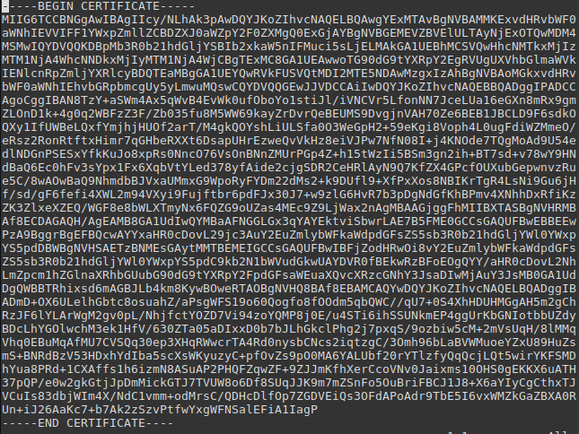

# Pergunta 4 - Algoritmos e Tamanhos das Chaves

Todas as imagens e outros ficheiros considerados relevantes para o entendimento complementar da resolução a todas as questões encontram-se listados na secção de [**Notas/Observações Finais**](#notasobservações-finais).

1. [**Pergunta P4.1**](#pergunta-p41---extraçãocriação-de-um-certificado) - **Extração/Criação de um Certificado e Visualização de Informações nele contidas**
    - Pequeno enquadramento site usado para retirar o Certificado.
    - Criação e visualização do Certificado.
    
---

## Resolução da Pergunta 4

### Pergunta P4.1 - Extração/Criação de um Certificado

Tendo em conta o site disponibilizado e o número de grupo, somos redirecionados para a página https://webgate.ec.europa.eu/tl-browser/#/tl/IT/45.

Nesta página existem alguns separadores. Selecionando o separador "*Qualified certificate for eletronic signature*" encontram-se apenas dois certificados. Dado que se pretende considerar apenas o último certificado emitido, escolhe-se então o certificado com validade maior.

<br/>

<p align="center">
    
</p>


<br/>

 Este certificado é emitido pela EC [Lottomatica Holding S.r.l.](https://webgate.ec.europa.eu/tl-browser/#/tl/IT/45) e tem de nome [C=IT, O=Lottomatica Holding S.r.l., OID.2.5.4.97=VATIT-02611940038
, CN=Lottomatica EU Qualified Certificates CA](https://webgate.ec.europa.eu/tl-browser/#/tl/IT/45/2)

<br/>

**Seguindo-se as instruções fornecidas na Nota 2, eis a informação dada para este Certificado:**

1. Escolha do Certificado e Criação do mesmo em modo txt.

<br/>

<p align="center">
    
</p>


<br/>

2. Resultado do comando `openssl x509 -in Certificado.crt -text -noout`.

```
Certificate:
    Data:
        Version: 3 (0x2)
        Serial Number: 8300078235990154896 (0x732fcd2e1024de90)
    Signature Algorithm: sha256WithRSAEncryption
        Issuer: CN = Lottomatica EU Qualified Certificates CA, 2.5.4.97 = VATIT-02611940038, O = Lottomatica Holding S.r.l., C = IT
        Validity
            Not Before: Dec 23 13:56:08 2019 GMT
            Not After : Dec 22 13:56:08 2049 GMT
        Subject: CN = Lottomatica EU Qualified Certificates CA, 2.5.4.97 = VATIT-02611940038, O = Lottomatica Holding S.r.l., C = IT
        Subject Public Key Info:
            Public Key Algorithm: rsaEncryption
                Public-Key: (4096 bit)
                Modulus:
                    00:df:13:cd:8f:9a:49:69:b8:03:1e:6a:5a:f0:78:
                    12:f5:a4:d2:e7:ce:6e:86:28:d6:cb:62:26:5f:e2:
                    54:d0:95:af:92:df:a2:73:4d:ec:97:1e:2d:46:b5:
                    e9:e1:97:9f:c9:91:c7:d8:26:64:b3:a7:0f:59:3e:
                    e2:0d:2a:d9:60:45:cd:9d:c5:fd:96:f4:df:97:ee:
                    f0:ce:56:5b:af:64:6b:26:6b:0e:fa:d0:78:11:14:
                    31:2f:43:be:08:e7:54:01:fb:d1:97:ba:04:40:75:
                    24:10:8b:0f:d1:7a:b1:d9:0e:41:7c:b5:21:f5:16:
                    05:e2:d0:c5:f6:26:8e:18:c7:50:e7:f6:6a:b4:ff:
                    33:88:24:40:e6:2c:84:b8:94:2d:27:da:d0:ed:d6:
                    78:6a:47:db:ee:7d:78:a8:22:f1:5a:29:87:82:f4:
                    ba:01:5d:89:66:4c:99:e3:bf:79:1b:33:d9:1a:27:
                    46:d7:ed:c4:78:a6:af:ba:86:1d:b7:91:5d:7b:7a:
                    0e:c6:a9:50:7a:c4:cf:07:90:bd:59:07:cf:c7:a2:
                    54:93:f0:ec:d7:cd:d3:c2:3e:8f:82:8d:39:d7:bb:
                    4d:08:0c:a0:07:7d:53:9e:1e:76:53:43:1a:73:d2:
                    11:2c:58:7e:42:ae:26:8f:31:a5:1b:34:36:77:0e:
                    ef:a5:6c:3a:70:4d:9d:93:14:ac:f1:a9:e1:9f:a1:
                    d7:9b:56:cc:88:b9:05:29:b7:82:7d:a2:87:e0:53:
                    ee:c7:7e:bf:bf:30:63:d1:cd:74:16:90:e8:47:34:
                    84:5b:f7:b1:8a:71:d4:5c:7a:5e:a6:d5:b5:82:de:
                    77:7e:fc:c9:f0:22:75:ed:9c:8e:04:83:47:60:9e:
                    1d:19:40:c8:df:50:ec:a7:d9:5f:81:8f:71:f3:94:
                    5e:e6:c6:7a:9c:27:bf:34:6e:7b:90:bf:f3:00:0e:
                    c0:16:90:f4:d8:66:75:b0:49:57:16:94:32:6c:46:
                    f5:6a:68:47:21:58:0e:6d:b6:74:cb:36:fa:4f:43:
                    51:f9:7d:f9:77:cf:c5:7a:2c:f0:d0:48:2a:b4:e0:
                    47:82:ec:36:2f:46:bb:a8:c7:7f:fb:1d:fe:01:7a:
                    7d:e7:e2:e1:75:8b:da:6f:78:55:7c:a2:f4:5b:a3:
                    7e:d6:eb:ea:97:45:27:1d:f4:27:bf:b0:f7:39:46:
                    e8:7b:d1:ed:bd:e9:0e:03:5d:19:f2:a1:04:f9:af:
                    e1:73:61:84:3c:51:7e:22:b3:64:ad:d9:97:17:97:
                    64:44:3f:58:61:7c:7b:c6:d6:2d:74:e6:c8:dc:7a:
                    15:06:46:f6:85:19:6a:ce:0c:11:cf:59:f4:b8:d6:
                    6b:1d:a7
                Exponent: 65537 (0x10001)
        X509v3 extensions:
            X509v3 Basic Constraints: critical
                CA:TRUE, pathlen:0
            X509v3 Authority Key Identifier: 
                keyid:D1:86:2C:6C:77:A9:80:18:12:4B:6F:89:26:F0:AC:B0:04:EC:1E:45

            Authority Information Access: 
                OCSP - URI:http://ocsp.ca.firmadigitale.lottomaticaitalia.it

            X509v3 Certificate Policies: 
                Policy: 1.3.76.49
                  CPS: http://ca.firmadigitale.lottomaticaitalia.it/documenti

            X509v3 CRL Distribution Points: 

                Full Name:
                  URI:http://ca.firmadigitale.lottomaticaitalia.it/qtspcacrlh2020.crl

            X509v3 Subject Key Identifier: 
                D1:86:2C:6C:77:A9:80:18:12:4B:6F:89:26:F0:AC:B0:04:EC:1E:45
            X509v3 Key Usage: critical
                Certificate Sign, CRL Sign
    Signature Algorithm: sha256WithRSAEncryption
         39:83:f8:e5:fa:50:b7:a5:84:66:ed:73:ca:2c:b9:a8:59:fd:
         a3:ec:81:61:52:d7:da:3a:d1:0a:20:7e:8f:1f:38:e7:66:e6:
         a6:d0:58:2f:ff:a9:4e:fe:d1:2e:17:84:70:d4:1c:c1:a0:00:
         7e:66:da:00:a1:47:32:45:ea:56:0b:02:b5:a0:33:68:2f:d2:
         92:ff:36:18:df:72:d6:0e:64:3e:d5:8b:de:33:a1:84:0c:3f:
         c8:f4:13:fb:b8:49:38:ba:8a:14:92:50:d9:26:10:fe:20:81:
         4a:ca:6c:63:48:a2:d6:db:51:97:72:04:37:0b:85:81:8e:97:
         07:21:33:77:a4:d4:77:d5:ff:ad:f4:65:36:b4:e5:a0:c8:c7:
         10:f4:6f:b6:c9:2e:11:a4:72:53:e1:83:68:fb:a7:1a:92:ff:
         da:33:6e:2c:39:70:cf:b6:99:5b:14:a8:7f:fc:94:c3:2a:56:
         1a:b4:10:1b:8c:a8:07:cc:53:b0:95:49:0a:b7:d1:ea:77:5c:
         7a:91:5b:07:2b:4c:0e:11:77:49:f2:b1:b0:8d:72:cd:a2:aa:
         dc:e0:0b:fd:ce:9a:1f:7a:6c:b6:81:55:63:2e:a1:e6:19:c5:
         4f:3d:1e:e6:6c:99:2f:81:35:17:41:cd:5e:77:1c:3c:61:61:
         d2:1b:6b:9b:1c:5e:c5:8a:ca:ec:f2:0b:ea:5f:3a:f6:6c:f6:
         93:b4:30:0e:98:00:b5:1b:7f:6d:2b:61:39:73:7f:24:2a:41:
         c8:cb:42:de:70:8a:b6:0a:15:23:03:85:8b:9a:f0:f4:5d:fb:
         50:97:01:f7:ec:d6:1e:a2:ce:63:7c:01:2b:80:3f:63:c7:40:
         56:6a:c1:91:7e:f5:92:49:98:a7:e1:5d:ea:c2:72:85:4d:bf:
         42:5a:8b:19:ac:d7:43:87:4b:48:04:28:a5:fa:b8:04:c7:df:
         ba:50:3f:f7:b4:c3:68:24:1a:d8:c9:a4:39:8c:89:c9:06:4c:
         9e:d3:55:45:bc:a3:a0:df:f1:25:2a:24:92:bd:9b:b9:99:4a:
         71:68:e4:eb:81:ae:21:41:08:9d:49:f3:e5:fa:69:82:32:0a:
         00:ad:87:14:c9:54:2b:88:b3:cd:dd:6e:35:88:9b:85:ff:35:
         d0:b5:be:69:be:a1:d3:2b:b0:2f:d0:0c:77:03:95:f3:a9:ed:
         91:83:54:48:90:b3:73:85:74:03:e8:01:da:fd:4d:b1:39:23:
         ab:f1:58:c6:64:19:a6:41:5c:0d:11:52:7f:a2:27:6e:80:68:
         a7:3b:f9:be:c0:93:6c:d2:ce:f3:ed:7f:06:31:81:61:4d:49:
         a9:44:16:20:35:21:a8:0f
```

<br/>

**Conclusões:**

| Algoritmo da Assinatura    | Tamanho da *Private Key* |
| -------------------------- | ------------------------ |
| Sha256 with RSA encryption | 4096 *bits*              |

- Certificado válido de 23 de Dezembro de 2019 até 22 de Dezembro de 2049.
- Chave Pública baseia-se no RSA com 4096 *bits*.
  - Dessa forma, torna-se num Certificado seguro, dado que a chave RSA possui mais de 3000 *bits*.

## Notas/Observações Finais

- Imagem [**Qualified Certificate**](https://github.com/uminho-miei-engseg-19-20/Grupo5/blob/master/Trabalhos%20Pr%C3%A1ticos/TP1/P4%20-%20Algoritmos%20e%20Tamanhos%20das%20Chaves/Images/Qualified%20Certificate.png) corresponde à página Web da EC Lottomatica Holding S.r.l..
- Imagem [**Certificado**](https://github.com/uminho-miei-engseg-19-20/Grupo5/blob/master/Trabalhos%20Pr%C3%A1ticos/TP1/P4%20-%20Algoritmos%20e%20Tamanhos%20das%20Chaves/Images/Certificado.png) permite validar a correta criação do Certificado.
- Ficheiro [**Certificado.crt**](https://github.com/uminho-miei-engseg-19-20/Grupo5/blob/master/Trabalhos%20Pr%C3%A1ticos/TP1/P4%20-%20Algoritmos%20e%20Tamanhos%20das%20Chaves/Certificado.crt) corresponde ao Certificado em si.
