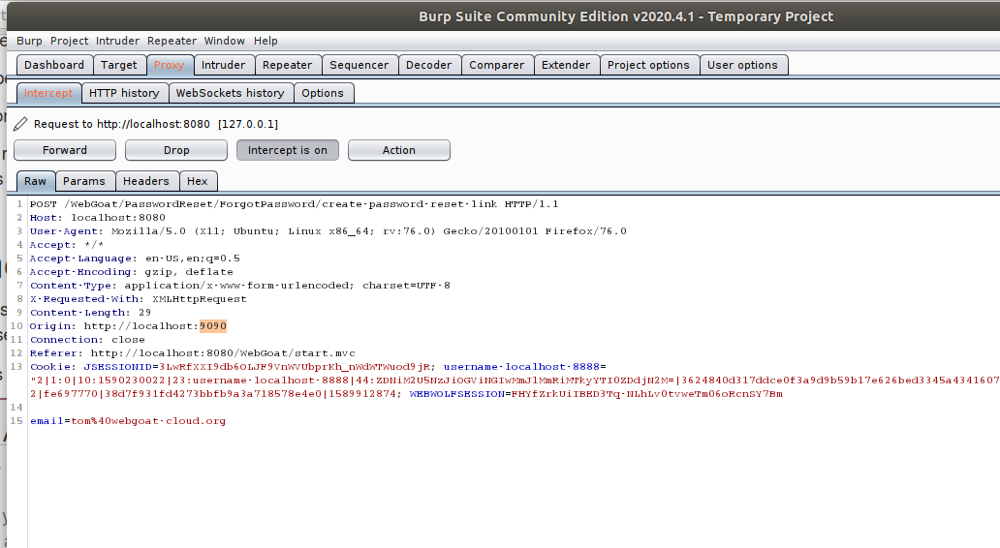

# Pergunta 3 - Quebra na Autenticação

Todas as imagens e outros ficheiros considerados relevantes para o entendimento complementar da resolução a todas as questões encontram-se listados na secção de [**Notas/Observações Finais**](#notasobservações-finais).

1. [**Pergunta  3.1**](#) - ***Password Reset***

---

## Resolução da Pergunta 3

### Pergunta  3.1 - *Password Reset*

Esta lição do *WebGoat* coloca a lente numa funcionalidade presente em quase todos os serviços e aplicações, o *reset* da palavra-passe.
Assim irá ensinar como implementar de maneira segura essa funcionalidade uma aplicação.

Esta aula utiliza o *WebWolf* para a parte do *email*.

- O primeiro passo consiste em ir buscar a *password* nova randomizada ao email do serviço *WebWolf* e entrar no serviço.

- O segundo passo nos demonstra que alguns sites têm implementado uma ajuda visual que nos diz se o *email* existe no serviço, o que pode parecer normal, mas na verdade ajuda phishing, quando se tem a confirmação se o *email* e a pessoa a *hackear* utiliza efetivamente o serviço.

- O terceiro passo é a demonstrar a facilidade de adivinhar respostas a `questões secretas` como forma de recuperar a *password* num serviço. Neste caso adivinhou-se facilmente que o utilizador 
  - `admin` tinha como cor favorita `green`.
  - `tom` -> `purple`
  - `larry` -> `yellow`

- O quarto passo demonstra que algumas perguntas têm respostas facilmente identificáveis na partilha em redes sociais do utilizador a atacar, como por exemplo a cidade onde nasceu ou perguntas que têm respostas binomiais como "Em que pulso usas o relógio?"

- O quinto passo demonstra uma pergunta completa sobre como atacar um serviço e tentar recuperar a password dum outro utilizador tom@webgoat-cloud.org utilizando um serviço de *proxies* e programa BURP.

Com ele podemos alterar o *request* para o serviço *WebWolf* e depois com esse serviço obter o *link* para fazer reset à palavra passe do Tom, conseguindo assim hackear o utilizador.

---

## Notas/Observações Finais

Não existem observações finais para este Trabalho Prático.