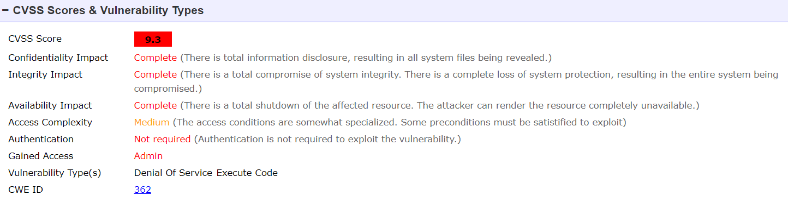

# Pergunta 3 - Protocolo SSH

1. [**Experiência 3.1**](#experiência-31---teste-ao-servidor-através-do-programa-ssh-auditpy) - **Análise do *output* dado pelo programa *ssh-audit.py***
    - Uso do programa *ssh-audit.py* para teste
    - Análise do seu *output*

2. [**Pergunta P3.1**](#pergunta-31---análise-da-segurança-de-dois-servidores-ssh-de-empresas-comerciais-no-porto) - **Análise da segurança de dois Servidores SSH de empresas comerciais no Porto**
	- Uso do programa *ssh-audit.py* para esses dois servidores
	- Estudo do *output* dado pelo programa *ssh-audit.py*
	- Uso do *website Shodan* para análise das vulnerabilidades
	- CVE Details

---

## Resolução da Pergunta 3

### Experiência 3.1 - Teste ao Servidor através do programa *ssh-audit.py*

- *Software* utilizado pelo Servidor;
- Protocolo implementado pelo *software* e suas compatibilidades para as várias versões;
- Informações acerca das Cifras;
- Algoritmos MAC;

---

### Pergunta 3.1 - Análise da segurança de dois Servidores SSH de empresas comerciais no Porto

Começa-se por escolher dois Servidores SSH de empresas comerciais alojadas no Porto. Conforme enunciado, facilita-se esta pesquisa pelo uso do *website* [Shodan](https://www.shodan.io/), pesquisando por `port:22 country:pt city:braga`.

<br/>

#### Escolha dos Servidores e *output* dado pelo programa *ssh-audit.py*

Com a filtragem feita surge uma lista de servidores com o SSH ativo na porta número 22. Os servidores escolhidos correspondem à **Vodafone Portugal** e à **Universidade do Porto**.

- [Vodafone Portugal](https://www.shodan.io/host/178.166.18.42)

- [Universidade do Porto](https://www.shodan.io/host/193.137.28.238)

*Os PDF que contêm o output dado pelo programa SSH Audit encontram-se na Secção [Notas/Observações Finais](#notasobservações-finais)*

<br/>

#### *Software* e Versão utilizada pelos Servidores SSH

Recorrendo ao *output* de ambos os servidores enumerados acima, conseguimos obter a informação que precisamos pela simples observacão do tópico inicial ***#general***.

<br/>

1. **Vodafone Portugal**

```python
# general
(gen) banner: SSH-2.0-OpenSSH_4.3-HipServ
(gen) software: OpenSSH 4.3 (HipServ)
(gen) compatibility: OpenSSH 4.2-6.6, Dropbear SSH 0.53+ (some functionality from 0.52)
(gen) compression: enabled (zlib@openssh.com)
```

- Uso do sistema operativo desconhecido.
- Uso do protocolo `SSH 2.0` implementado pelo *software* `OpenSSH 4.2 HipServ`.
  - Protocolo compatível com as versões 4.2 e 6.6 do `OpenSSH`
  - Protocolo compatível com o `Dropbear SSH` para versões iguais ou superiores à 0.53, ainda com alguma funcionalidade para a versão 0.52 do mesmo.

<br/>

2. **Universidade do Porto**

```python
# general
(gen) banner: SSH-2.0-OpenSSH_7.4
(gen) software: OpenSSH 7.4
(gen) compatibility: OpenSSH 7.3+ (some functionality from 6.6), Dropbear SSH 2016.73+
(gen) compression: enabled (zlib@openssh.com)
```

- Uso do sistema operativo desconhecido.
- Uso do protocolo `SSH 2.0` implementado pelo *software* `OpenSSH 7.4`.
  - Protocolo compatível com versões iguais ou superiores à 7.3 do `OpenSSH`, ainda com alguma funcionalidade para a versão 6.6 do mesmo.
  - Protocolo compatível com o `Dropbear SSH` para versões iguais ou superiores à 2016.73.

<br/>

#### Estudo vulnerabilidades para as versões de Software dos Servidores SSH

Tendo como referência as versões de *software* abordadas na análise anterior, pode-se fazer um apuramento da lista/quantidade de vulnerabilidades para ambos (. Com essa lista e sua respetiva contagem, conclui-se qual o *software* com mais vulnerabilidades.

| Fontes\Software                                              | `OpenSSH 4.3`                | `OpenSSH 7.4`                |
| ------------------------------------------------------------ | ---------------------------- | ---------------------------- |
| *Website* [Shodan](https://www.shodan.io/host/178.166.18.42) | 0 vulnerabilidades listadas  | 27 vulnerabilidades listadas |
| *Website* [CVE Details](https://www.cvedetails.com/vulnerability-list/vendor_id-97/product_id-585/version_id-37157/Openbsd-Openssh-4.3.html) | 17 vulnerabilidades listadas | 2 vulnerabilidades listadas  |
| **Total Vulnerabilidades**                                   | 17 vulnerabilidades          | 29 vulnerabilidades          |

Dessa forma, conclui-se que o Servidor SSH da Universidade do Porto apresenta mais vulnerabilidades. Isto faz algum sentido dado a diferença de dimensão de ambas as "empresas" em causa.

<br/>

#### Vulnerabilidade mais grave pelo CVE Details

A vulnerabilidade mais grave detetada corresponde ao [CVE-2006-5051](https://www.cvedetails.com/cve/CVE-2006-5051/), avaliada num CVSS Score de 9.3.

>  Signal handler race condition in OpenSSH before 4.4 allows remote attackers to cause a denial of service (crash), and possibly execute arbitrary code if GSSAPI authentication is enabled, via unspecified vectors that lead to a double-free.

<p align="center">
    
</p>


Pela descrição e pela análise dos parâmetros que acompanham o *score* geral, notamos uma gravidade acrescida, dado que ao existir um possível *Denial of Service*, pode-se comprometer de forma total a **confidencialidade**, **integridade** e **disponibilidade** do sistema em si. Portanto, considera-se como sendo uma vulnerabilidade grave para efeitos práticos.

---

## Notas/Observações Finais

- PDF [**Shodan - Vodafone**](https://github.com/uminho-miei-engseg-19-20/Grupo5/blob/master/Trabalhos%20Pr%C3%A1ticos/TP2/P3%20-%20Protocolo%20SSH/Shodan%20-%20Vodafone.pdf) que contém todo o resultado dado pelo *website Shodan* relativamente ao servidor da empresa Vodafone alojado no Porto.
- Ficheiro texto [**SSH Audit - Vodafone**](https://github.com/uminho-miei-engseg-19-20/Grupo5/blob/master/Trabalhos%20Pr%C3%A1ticos/TP2/P3%20-%20Protocolo%20SSH/SSH%20Audit%20-%20Vodafone.txt) que contém todo o resultado dado pelo comando SSH Audit relativamente ao endereço IP desse servidor.
- PDF [**Shodan - Universidade do Porto**](https://github.com/uminho-miei-engseg-19-20/Grupo5/blob/master/Trabalhos%20Pr%C3%A1ticos/TP2/P3%20-%20Protocolo%20SSH/Shodan%20-%20Universidade%20do%20Porto.pdf) que contém todo o resultado dado pelo *website Shodan* relativamente ao servidor da empresa Universidade do Porto alojado no Porto.
- Ficheiro texto [**SSH Audit - Universidade do Porto**](https://github.com/uminho-miei-engseg-19-20/Grupo5/blob/master/Trabalhos%20Pr%C3%A1ticos/TP2/P3%20-%20Protocolo%20SSH/SSH%20Audit%20-%20Universidade%20do%20Porto.txt) que contém todo o resultado dado pelo comando SSH Audit relativamente ao endereço IP desse servidor.
- Imagem [**CVE-2006-5051**](https://github.com/uminho-miei-engseg-19-20/Grupo5/blob/master/Trabalhos%20Pr%C3%A1ticos/TP2/P3%20-%20Protocolo%20SSH/Images/CVE-2006-5051.png) que mostra a descrição da vulnerabilidade mais grave para o *software* do servidor SSH da Universidade do Porto.