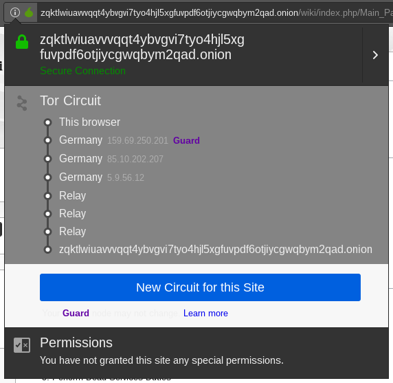

# Pergunta 1 - TOR (The Onion Router)

Todas as imagens e outros ficheiros considerados relevantes para o entendimento complementar da resolução a todas as questões encontram-se listados na secção de [**Notas/Observações Finais**](#notasobservações-finais).

1. [**Experiência 1.1**](#experiência-11---mudança-localização-geográfica-através-do-anonsurf) - **Mudança localização geográfica**
    - Uso do comando `anonsurf`para efetuar uma navegação anónima.
    - Mudança de endereço IP através desse comando.
    - Conclusões acerca do potencial do mesmo.

2. [**Pergunta P1.1**](#pergunta-p11---acesso-a-sites-dos-eua-através-o-anonsurf-start) - **Acesso a sites dos EUA**
	- Uso do comando `anonsurf start` para tentar aceder a uma localização específica.
	- Pequena contextualização com o funcionamento do protocolo TOR.

3. [**Pergunta P1.2**](#pergunta-p12---análise-do-circuito-de-ors-de-um-website) - **Análise dos circuitos de um *website***
	- Uso do *browser* TOR para verificar o circuito de um determinado *website*
	- Pequena contextualização com o funcionamento do protocolo TOR.

---

## Resolução da Pergunta 1

### Experiência 1.1 - Mudança localização geográfica através do `anonsurf`

Ao realizarmos todos os passos propostos para esta experiência somos capazes de compreender a utilidade de cada comando em todo o processo, na medida em que nos ajudam a compreender como o TOR auxilia nesta tarefa de nos "camuflarmos" a nível de IP.

- Executar comando `sudo anonsurf myip`

  - Este comando permite-nos verificar o endereço IP inicial
  - IP dado como `162.247.74.213`

- Executar comando `sudo anonsurf start`

  - Força o encerramento do *browser* caso se encontre aberto
  - Limpeza de eventuais elementos em cache perigosos
  - Imobiliza os serviços IPv6

**Após todos estes passos, inicia uma modo anónimo, onde todo o tráfico passa a ser redirecionado através do TOR em si.**

 

	

 

- Executar novamente comando `sudo anonsurf myip`

  - Nova verificação do endereço IP
  - IP dado como `185.220.100.241`
  - O `start` anterior resultou, dado que o endereço IP é agora diferente do que se obteve inicialmente

- Executar comando `sudo anonsurf change`

  - O TOR é recarregado e forçado a mudar os *nodes*

- Executar novamente comando `sudo anonsurf myip`

  - Nova verificação do endereço IP
  - IP dado como `178.175.148.42`

- Executar comando `sudo anonsurf stop`

  - Forçamos a paragem da navegação anónima
  - Processo similar ao de `start`, sendo que acaba por fazer o inverso em algumas características.

 

	

 

Desta forma verificamos que o endereço IP incial é mantido, corroborando a ideia de que o serviço de navegação anónima funciona e que permite simular um IP que não é o nativo e com isso fornecer uma segurança em termos de circulação de tráfego.

---

### Pergunta P1.1 - Acesso a sites dos EUA através o `anonsurf start`

Estando a experiência anterior realizada e devidamente compreendida, ficamos com uma ideia daquilo que cada comando representa na totalidade do processo de navegação anónima. Dessa forma, fica clara a impossibilidade do comando `sudo anonsurf start` em garantirar que estamos localizados nos EUA.

 

**Veja-se uma breve explicação acerca do funcionamento do protocolo TOR:**

- O TOR implementa a técnica de comunicação *Onion Routing* que consiste na ideia de uma rede em forma de "cebola", onde existem várias camadas criptográficas de nome *Onion Routers*, análogas às camadas de uma cebola.

- A ideia é transmitir os dados através desta série de camadas, onde ao longo de todo o caminho se "descasca" uma única camada de modo a se obter o próximo destino na rede - criando assim aquilo a que se chama de **circuito**.

- Cada um dos OR's correspondente ao circuito é selecionado a partir de um algoritmo que, entre outros, tenta evitar que todo o circuito em si seja criado num mesmo país ou pelo mesmo participante da rede.
- Cada OR sabe apenas uma parte do circuito que lhe compete.

 

Esta impossibilidade de atribuir ao utilizador uma localização específica através do comando em causa deve-se então ao facto do processo de estabelecimento de circuito através da rede TOR ser um processo executado de forma aleatória e independente ao utilizador em si, ou seja, podemos saber as localizações que os circuitos abrangem, mas não podemos escolher estar especificamente numa, dado que o TOR garante anonimato ponto a ponto.

**A ideia de OR's (*Onion Routers*) ficará mais clara ao resolver a pergunta seguinte, tendo em conta que analisaremos o circuito e as OR's que dele fazem parte.**

---

### Pergunta P1.2 - Análise do circuito de OR's de um *website*

 

#### Circuito para o *website* [http://zqktlwi4fecvo6ri.onion/wiki/index.php/Main_Page](http://zqktlwi4fecvo6ri.onion/wiki/index.php/Main_Page)

Veja-se a imagem seguinte que corrosponde ao circuito TOR para o *website* em causa. **Através dela podemos comprovar a existência de seis OR's (*Onion Routers*) :**

- Os três primeiros OR's localizam-se na Alemanha
- Os outros três correspondem a *Relay*

 

    

 

#### Análise dos *Onin Routers* no contexto do protocolo TOR

Estando analisada a constituição do circuito em si, torna-se necessário entender estes saltos que são dados até ao *website* Onion e o porquê de existirem, tendo como base o funcionamento do protocolo TOR. 

Os circuitos de que falamos estão associados aos serviços anónimos e pontos de *rendezvous* (pontos de encontro), estando a existência destes 6 saltos associada à utilização desse mesmo tipo de serviços. Com isto quer-se dizer que a entidade responsável por este *website* decidiu providenciar um serviço anónimo aos seus utilizadores. É esse serviço que vamos tentar compreender.

**Para efeitos de compreensão, assume-se o Bob como sendo o *website* e a Alice como sendo um utilizador comum (aquele que acede ao servidor *Web*).**

- O Bob cria alguns *Introduction Points* que são comunicados ao *Directory Server*
  - Assinados com a *Public Key*
  - São como "caminhos"  que os futuros utilizadores têm de "atravesar" quando consultarem o *website*
- Criação de circuitos para cada um dos *Introduction Points*
  - Ficam à espera da solicitação por parte dos utilizadores

- O Bob comunica todo este serviço ao *Directory Server*

 

    

 

- Serviço *Web* pronto para ser acedido
- A Alice sabe da existência do servidor *Web*, pedindo mais detalhes sobre o mesmo ao *Directory Server*
- A Alice estabelece um *Rendezvous Point* para a ligação em causa
  - Através deste caminho, a Alice fornece um segredo que é depois reconhecido pelo próprio servidor
- A Alice escreve uma mensagem para o Bob
  - Constituída por um **Segredo (*Rendezvous Cookie*)** + ***Rendezvous Point*** + **Primeira Parte do protocolo de troca de chaves *Diffie-Hellman***
  - Encriptada com a *Public Key* do servidor *Web*
- A Alice solicita um *Introduction Point* para poder enviar a mensagem
  - O IP reencaminha esta mensagem para o servidor *Web* através do circuito TOR

 

    

 

- O Bob cria um circuito até ao *Rendezvous Point* da Alice
  - Envia através dele o **Segredo (*Rendezvous Cookie*)** + **SegundaParte do protocolo de troca de chaves *Diffie-Hellman*** + ***hash* da chave de sessão** (que ambos passam a partilhar)
- Estabelecimento de um circuito entre o utilizador e o servidor *Web*
  - Constituído por 6 *Onion Routers*
    - Três primeiros OR's correspondem ao circuito TOR entre o utilizador e o *Rendezvous Point*
    - Outros três correspondem ao circuito TOR entre o servidor *Web* e o *Rendezvous Point*

 

    

 

**Assim, os pontos essenciais que se devem reter são os seguintes:**

- O utilizador (quem acede) escolhe três OR's
  - O terceiro destes três OR's corresponde a um RP que será usado para que se construa o circuito TOR
- O servidor escolhe os restantes três OR's
- O único canal de conhecimento mútuo entre estas duas entidades corresponde ao RP (*Rendezvous Point*)
- A existência de células *relay* é necessária para a transferência de dados de uns OR's para outros no decorrer da comunicação
  - Dados essenciais para que a conexão seja estabelecida

---

## Notas/Observações Finais

- Imagem [**anonsurf start**](https://github.com/uminho-miei-engseg-19-20/Grupo5/blob/master/Trabalhos%20Pr%C3%A1ticos/TP3/P1%20-%20Thor%20(The%20Onion%20Router)/Images/anonsurf%20start.png) que mostra as informações dadas pelo anonsurf quando o mesmo é iniciado.
- Imagem [**anonsurf stop**](https://github.com/uminho-miei-engseg-19-20/Grupo5/blob/master/Trabalhos%20Pr%C3%A1ticos/TP3/P1%20-%20Thor%20(The%20Onion%20Router)/Images/anonsurf%20stop.png) que mostra as informações dadas pelo anonsurf quando o mesmo é parado.
- Imagem [**Circuito**](https://github.com/uminho-miei-engseg-19-20/Grupo5/blob/master/Trabalhos%20Pr%C3%A1ticos/TP3/P1%20-%20Thor%20(The%20Onion%20Router)/Images/Circuito.png) que mostra o circuito do *website* [http://zqktlwi4fecvo6ri.onion/wiki/index.php/Main_Page](http://zqktlwi4fecvo6ri.onion/wiki/index.php/Main_Page).
- Imagem [**TOR Onion Services, Part 1-2**](https://github.com/uminho-miei-engseg-19-20/Grupo5/blob/master/Trabalhos%20Pr%C3%A1ticos/TP3/P1%20-%20Thor%20(The%20Onion%20Router)/Images/TOR%20Onion%20Services%2C%20Part%201-2.png) que detalha os dois primeiros passos do funcionamento do protocolo TOR.
- Imagem [**TOR Onion Services, Part 3-4**](https://github.com/uminho-miei-engseg-19-20/Grupo5/blob/master/Trabalhos%20Pr%C3%A1ticos/TP3/P1%20-%20Thor%20(The%20Onion%20Router)/Images/TOR%20Onion%20Services%2C%20Part%203-4.png) que detalha o terceiro e quarto passos do funcionamento do protocolo TOR.
- Imagem [**TOR Onion Services, Part 5-6**](https://github.com/uminho-miei-engseg-19-20/Grupo5/blob/master/Trabalhos%20Pr%C3%A1ticos/TP3/P1%20-%20Thor%20(The%20Onion%20Router)/Images/TOR%20Onion%20Services%2C%20Part%205-6.png) que detalha os dois últimos passos do funcionamento do protocolo TOR.