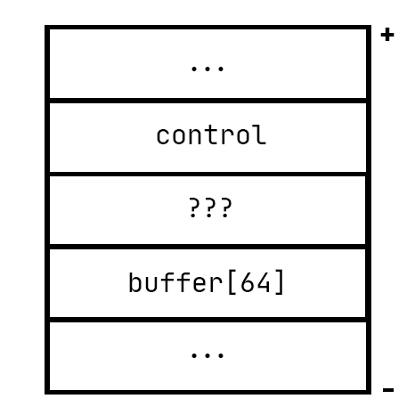

# Pergunta 1 - *Buffer Overflow*

Todas as imagens e outros ficheiros considerados relevantes para o entendimento complementar da resolução a todas as questões encontram-se listados na secção de [**Notas/Observações Finais**](#notasobservações-finais).

1. [**Pergunta P1.1**](#pergunta-p11---buffer-overflow-em-várias-linguagens) - ***Buffer Overflow* em várias linguagens**
   - Análise do programa `LOverflow2` em três linguagens distintas
   - Compreensão do comportamento do programa

2. [**Pergunta P1.2**](#pergunta-p12----buffer-overflow) - ***Buffer Overflow***
   - Análise dos programas `RootExploit` e `0-simple` escritos em C
   - Deteção vulnerabilidade de *Buffer Overflow* existente
   - Exploração dessa vulnerabilidade

3. [**Pergunta P1.3**](#pergunta-p13---read-overflow) - ***Read Overflow***
   - Análise do programa `ReadOverflow` escrito em C

4. [**Pergunta P1.4**](#pergunta-p14) - ***Buffer Overflow***
   - Compilação e execução do programa `1-match` escrito em C
   - Conceitos *little-endian* e *big-endian*

5. [**Pergunta P1.5**](#pergunta-p15---buffer-overflow-na-heap) - ***Buffer Overflow* na *Heap***
   - Técnicas de programação defensiva para mitigar vulnerabilidades de *Buffer Overflow* na *Heap*

6. [**Pergunta P1.6**](#pergunta-p16---buffer-overflow-na-stack) - ***Buffer Overflow* na *Stack***
   - Técnicas de programação defensiva para mitigar vulnerabilidades de *Buffer Overflow* na *Stack*

---

## Resolução da Pergunta 1

### Pergunta P1.1 - ***Buffer Overflow* em várias linguagens**

Se analisarmos os ficheiros referentes ao `LOverflow2` para as três linguagens distintas, conseguimos detetar um conjunto de padrões e diferenças características das linguagens em si.

Apesar dessas diferenças, a ideia deste programa é universal  - armazenar num *buffer* tantos números quantos aqueles que são pedidos sob a forma de *input*. Apesar dessa ser a ideia teórica, constata-se que existem erros/problemas na execução deste programa que iremos detalhar a seguir.

Para as três linguagens, o problema central do programa `LOverflow2`  está na não verificação do primeiro inteiro que é pedido e depois inserido em modo *input*, que pela análise do código teria de ser igual ou inferior a 10.

**O que se vai ver de seguida é a idealização de certos cenários que podem representar vulnerabilidades do programa e de que forma cada um deles reage perante os mesmos.**

<p>

#### 1. Análise do programa`LOverflow2` em Java

| Cenário                                                      | Reação do Programa                                           | Justificação                                                 |
| ------------------------------------------------------------ | ------------------------------------------------------------ | ------------------------------------------------------------ |
| Inserção de um inteiro muito elevado (*Overflow* de Inteiros) | O programa lança uma exceção `java.util.InputMismatchException` | No código consta que cada inteiro que é lido no *input* tem de ter entre [0-10] dígitos apenas |
| Inserção de quantidade de números ligeiramente superior a 10 | O programa lança uma exceção `java.lang.ArrayIndexOutOfBoundsException` | Impossibilidade de inserir além do índice 10 do *array* em si |
| Inserção de quantidade de números muito superior a 10        | O programa lança uma exceção `java.util.InputMismatchException` | Trata-se de um número muito superior a 10                    |
| Inserção de uma quantidade de números negativa               | O programa é terminado de imediato, não sendo pedido qualquer valor | Como o valor da variável `count` será negativo, não chega a entrar no ciclo que controla a inserção dos `count` números pedidos no *input* |

<p>

#### 2. Análise do programa`LOverflow2` em Python

| Cenário                                                      | Reação do Programa                                           | Justificação                                                 |
| ------------------------------------------------------------ | ------------------------------------------------------------ | ------------------------------------------------------------ |
| Inserção de um inteiro muito elevado (*Overflow* de Inteiros) | O programa não apresenta qualquer reação oposta/defensiva    | Isto deve-se ao facto das operações em si estarem em Python puro. Uma vez que os números inteiros Python têm uma precisão arbitrária (não têm comprimento de *bytes* fixo) não existe a possibilidade de *Overflow* |
| Inserção de quantidade de números ligeiramente superior a 10 | O programa vai pedindo os números até atingir o erro `IndexError` | A descrição do erro detalha que o índice que se quer alcançar está fora do *range* permitindo, daí a impossibilidade de inserir além do índice 10 do *array* em si |
| Inserção de quantidade de números muito superior a 10        | O programa lança uma exceção `OverflowError`                 | A descrição do erro detalha que o *range* de resultados possui demasiados itens a serem verificados no ciclo *for* do código em si. Isto acontece porque a função `range()` vai devolver demasiados resultados possíveis, criando-se um *Overflow* |
| Inserção de uma quantidade de números negativa               | O programa é terminado de imediato, não sendo pedido qualquer valor | A função `range()` do Python pode lidar com *ranges* negativos mas estes devem estar bem definidos e fazerem sentido. Dado que no código o range vai de `0` a `count-1` termos um valor de `count` negativo acabaria por não funcionar |
| Invocação de funções no próprio *input*                      | O programa consegue lidar com estas invocações, dependendo o *output* da função usada | A expressão absorvida no *stdin* é interpretada pelo Python, permitindo então a invocação a estas funções |

<br/>

Para este programa Python, salienta-se essencialmente esta possibilidade de invocar funções como algo mais perigoso/preocupante. Para que se entenda de forma mais intuitiva esta invocação, criou-se uma mini definição no próprio código Python, que permite explorar a vulnerabilidade associada ao uso da função `input` existente no código original.

```python
def test():
    print("Secret")
    
tests=[None]*10
count = input("Quantos numeros? ")
for i in range (0,count-1):
    test = input ("Insira numero: ")
    tests[i]=test
```

<br/>

**Com este código pronto, executa-se novamente o programa e verifica-se o seguinte resultado:**

<p align = "center">
    
</p>


Entende-se assim a ideia de invocar funções que são depois executadas em modo *script* e de que forma se pode imprimir como resultado uma hipotética mensagem secreta sem sequer ser necessário alterar o restante código.

<p>

#### 3. Análise do programa `LOverflow2` em  C++

| Cenário                                                      | Reação do Programa                                           | Justificação                                                 |
| ------------------------------------------------------------ | ------------------------------------------------------------ | ------------------------------------------------------------ |
| Inserção de um inteiro muito elevado (*Overflow* de Inteiros) | O programa imprime os restantes pedidos de números, não permitindo a sua introdução em termos de *input* | No código consta que cada inteiro que é lido no *input* tem de ter entre [0-10] dígitos apenas |
| Inserção de quantidade de números ligeiramente superiores a 10 | O programa gera mais pedidos de números do que o suposto     | Impossibilidade de inserir além do índice 10 do *array* em si |
| Inserção de quantidade de números muito superiores a 10      | O programa gera de forma repetida pedidos de números. Esta repetição acontece de forma infinita | Trata-se de um número muito superior a 10                    |
| Inserção de uma quantidade de números negativa               | O programa é terminado de imediato, não sendo pedido qualquer valor | Como o valor da variável `num_elems` será negativo, não chega a entrar no ciclo que controla a inserção dos `num_elems` números pedidos no *input* |

<br/>

**Estando feita toda esta triagem de resultados para os programas criados nas diferentes linguagens, surgem as seguintes conclusões:**

- Verifica-se que todas as linguagens concretizam os diferentes cenários que podem representar possíveis vulnerabilidades;
- Dado que são três linguagens distintas, o comportamento altera em alguns dos cenários;
- Apesar do comportamento ser diferente pelas várias linguagens, a justificação do porquê de estes erros acontecerem é semelhante entre os três programas;
- Nenhum dos programas faz uma verificação inicial da quantidade pedida pelo utilizador;
- Não há qualquer verificação em relação ao tipo de *input* recolhido.

---

### Pergunta P1.2  - *Buffer Overflow*

Para a resolução desta questão torna-se necessário estudar e compreender o algoritmo de cada programa, para que possam ser obtidas as respostas necessárias em termos de *exploit*. Relativamente ao ficheiro `RootExploit` pretende-se conseguir forçar permissões de root/admin mesmo sem usar a *password* adequada. No caso do ficheiro `0-simple` é suposto conseguir forçar a obtenção da mensagem "YOU WIN!!!".

**Pela análise rápida de ambos os programas, deteta-se desde logo o uso da função `gets`, que como o próprio compilador gcc indica, pode representar um grande perigo em termos de segurança de código. É precisamente através da compreensão do funcionamento da mesma que vamos conseguir fazer o *exploit* das vulnerabilidades seguintes.**

<p>

#### 1. Análise do programa `RootExploit` em  C

Comece-se por enumerar o algoritmo pensado para este programa. Com isto feito, pode-se detetar a vulnerabilidade existente e definir a forma de explorá-la.

<br/>

**1.1. Algoritmo do programa:**

- Cria duas variáveis de instância a ser usadas ao longo do programa

```C
int pass = 0;
char buff[4];
```

**A variável `pass` será usada para controlar o acesso root/admin do utilizador e a variável `buff` serve para armazenar a *password* dada pelo utilizador.**

- Solicita a *password* de *root* ao utilizador e obtém/guarda a mesma pelo uso da função `gets`

```C
printf("\n Insira a password de root: \n");
gets(buff);
```

- Compara essa *string password* com a string `csi1`, que corresponde à *password* válida para obter os privilégios

- Caso a *password* seja válida, a variável `pass` assume o valor de 1

```C
if(strcmp(buff, "csi1")) printf ("\n Password errada \n");
else{
    printf ("\n Password correcta \n");
    pass = 1;
}
```

- Caso `pass` tenha o valor de 1, são dadas as permissões de root/admin ao utilizador

```C
if(pass){
    /* Atribuir permissões de root/admin ao utilizador */
    printf ("\n Foram-lhe atribuidas permissões de root/admin \n");
}
```

<br/>

**1.2. Forma de explorar a vulnerabilidade do programa:**

Conforme dito anteriormente, o uso da função `gets` não deve ser considerado como uma solução válida, dado que esta função não trata de verificar o tamanho do *input* e de seguida comparar esse tamanho com aquele que foi alocado para a variável responsável por armazenar essa *string*. 

Uma vez que o *array* `buff` é declarado com caracteres de 4 *bytes*, entende-se que apenas podem ser introduzidos 3 caracteres, estando aqui representado todo o perigo. Acontece que se a escrita continuar o programa acaba por escrever para fora dos limites estabelecidos para o `buff`, o que permite que se altere o valor da variável `pass` que controla esta obtenção de privilégios.

<br/>

**Pense-se em termos de *stack* e a forma como os valores são colocados sobre a mesma:**

Apesar dos valores/variáveis serem colocados na *stack* desde os níveis mais altos até aos mais baixos, a escrita é feita no sentido contrário. Dessa forma, valida-se a *stack* apresentada abaixo, que mostra a variável `pass` acima do `buff`. 

<p align = "center">
    
</p>

Com esta estrutura pensada, a escrita para lá dos 3 caracteres do *buffer* permitirão romper o espaço de memória reservado para `buff`, fazendo com que se suba na *stack* e se altere o valor de `pass`. Como o código o indica, caso este valor seja diferente de 0, a *password* é reconhecida como verdadeira e o utilizador obtém os privilégios pretendidos.

<br/>

**Veja-se essa ideia em prática:**

<p align = "center">
     
</p>
<p>
<p>

#### 2. Análise do programa `0-simple` em  C

Comece-se por enumerar o algoritmo pensado para este programa. Com isto feito, pode-se detetar a vulnerabilidade existente e definir a forma de explorá-la.

<br/>

**2.1. Algoritmo do programa:**

- Cria duas variáveis de instância a ser usadas ao longo do programa, inicializando uma delas a 0
```C
int control;
char buffer[64];

printf("You win this game if you can change variable control'\n");

control = 0;
```

<br/>

- Solicita a *password* de *root* ao utilizador e obtém/guarda a mesma pelo uso da função `gets`, tal como o programa anterior

```C
gets(buffer);
```

<br/>

- Caso `control` tenha um valor diferente de 0, é imprimida a tal mensagem "YOU WIN!!!"

```C
if(control != 0) printf("YOU WIN!!!\n");
else printf("Try again...\n");
```

<br/>

**2.2. Forma de explorar a vulnerabilidade do programa:**

O problema continua a ser o mesmo do programa anterior - uso da função `gets` e a possibilidade de ir além do espaço alocado para a variável do buffer.

<br/>

**Para este programa, a *stack* seria algo como:**

Seguindo o mesmo pensamento aplicado para o programa anterior, a ideia seria escrever para lá dos 64 bytes do *buffer*, conseguindo assim aceder à variável `control` e dessa forma chegar ao resultado pretendido. Contudo, verificou-se que esta alteração só é possível caso se dê um *input* de 77 caracteres, levantando a dúvida da possibilidade de existir uma outra variável/endereço entre o `buffer` e o `control`.

<p align = "center">
    
</p>
<br/>

**Veja-se essa ideia em prática:**

<p align = "center">
     
</p>
---

### Pergunta P1.3 - *Read Overflow*

Igualmente ao que aconteceu no exercício anterior, onde era pedido para analisar e consequentemente testar um programa em C, repete-se o mesmo procedimento para esta questão. 

<p>

#### 1. Análise do programa `ReadOverflow` em  C

Comece-se por enumerar o algoritmo pensado para este programa em C para que seja possível depois testar o mesmo com o espírito crítico necessário para compreender a relação com a temática de *Read Overflow*.

<br/>

**1.1. Algoritmo do programa:**

- Cria quatro variáveis de instância a ser usadas ao longo do programa, entrado num ciclo *while* que existe enquanto o utilizador não forçar o término do programa

```C
char buf[100], *p;
int i, len;
```

- Solicita uma quantidade de caracteres ao utilizador e lê/armazena essa quantidade de caracteres pelo uso da função `fgets`

```C
printf("Insira numero de caracteres: ");
p = fgets(buf, sizeof(buf), stdin);
```
**Note-se que, contrariamente ao que acontecia no exercício anterior, já não se usa a função `gets`, que era claramente perigosa para a segurança dos dados existentes num programa.**

- Uma vez que o valor lido do *stdin* vem em modo string, converte essa *string* para modo inteiro

```C
len = atoi(p);
```

- Solicita uma frase ao utilizador e lê/armazena a mesma do mesmo modo usado para a quantidade de caracteres anterior

```C
printf("Insira frase: ");
p = fgets(buf, sizeof(buf), stdin);
```

- Através de um ciclo *for*, imprime apenas os `n` primeiros caracteres armazenados no `buf`. Caso este `buf` não tenha pelo menos os `n` caracteres, imprime um `.`.

```C
printf("ECO: |");
for (i=0; i<len; i++) {
	if (!iscntrl(buf[i])) putchar(buf[i]);
	else putchar('.');
}
```

- Reinicia o ciclo *while*, repetindo-se o processo.

<br/>

**1.2. Possíveis formas de explorar a vulnerabilidade do programa:**

De modo a tentar descobrir possíveis vulnerabilidades existentes para o programa, executou-se um conjunto de *inputs* diferentes para o programa e com isso fez-se um apanhado daquilo que poderia ser realmente prejudicial/perigoso para o mesmo.

<br/>

| Cenário                                                      | Reação do Programa                                           | Justificação                                                 |
| ------------------------------------------------------------ | ------------------------------------------------------------ | ------------------------------------------------------------ |
| Inserção de uma quantidade de número de caracteres negativa  | Permite que o utilizador insira a frase mas não é devolvido nenhum *output* | Como existe um ciclo *for* que permite controlar os caracteres que são impressos, a condição `i<len` não se verifica. Dessa forma, nada é devolvido. |
| Inserção de uma letra ao invés de um número                  | Permite que o utilizador insira a frase mas não é devolvido nenhum *output* | Como é feita a conversão do *input* que vem do *stdin* através do `atoi`, esta função devolverá 0 neste caso. Dessa forma, nada é devolvido. |
| Inserção de uma frase com um número de caracteres inferior ao definido inicialmente | São devolvidos apenas os `n` caracteres presentes na frase, sendo os outros representados pelo caracter `.` | Como no ciclo *for* existe um *if then else* que verifica o conteúdo do `buf` em si, caso não exista nada numa determinada posição do `buf`, devolve-se o caracter `.`. |

<br/>

**Estando feita toda esta triagem de resultados para o programa, surgem as seguintes conclusões:**

- Estes cenários testados para o programa não apresentam qualquer comportamento de alarme e de risco, dado que não se torna possível introduzir conteúdo para lá do espaço alocado ou até mesmo um acesso não autorizado a dados confidenciais, como acontecia na *password* do exercício anterior;
- O uso inteligente da função `fgets` ao invés da `gets` permite que exista uma validação do tamanho do *input* dado pelo utilizador. Dessa forma, apenas são lidos a quantidade de caracteres permitida para o `buf` em causa;
- Continua a não existir uma verificação do número de caracteres fornecido pelo utilizador, ou seja, se corresponde realmente a um inteiro ou não;
  - Esta situação acaba por ser controlada pelo uso da função `atoi`. Isto funciona caso sejam escritas apenas letras ou letras seguidas de números. Caso o *input* seja do tipo `12asas`, o programa tem em consideração os 12 caracteres definidos antes das letras.

<br/>

Uma vez que o *buffer* em si nunca chega a ser libertado/limpo e que o número de caracteres nunca é comparado com o tamanho da *string* fornecida pelo utilizador, pode chegar a existir um problema de *Read Oveflow* - possibilidade de ler o conteúdo de zonas do *buffer* que não foram escritas pela frase fornecida, mas sim por anteriores a esta.

**Veja-se essa ideia em prática:**

<p align = "center">
    
</p>
---

### Pergunta P1.4

O programa em C intitulado de `1-match.c` tem a seguinte algoritmia:

```C
int main(int argc, char **argv)
{
  int control;
  char buffer[64];

  if(argc == 1) {
      errx(1, "please specify an argument\n");
  }

  printf("You win this game if you can change variable control to the value 0x61626364'\n");

  control = 0;
  strcpy(buffer, argv[1]);

  if(control == 0x61626364) {
      printf("Congratulations, you win!!! You correctly got the variable to the right value\n");
  } else {
      printf("Try again, you got 0x%08x\n, instead of 0x61626364", control);
  }
}
```
1. Lê uma *string* como argumento.
2. Cria a variável inteira `control` com o valor de 0
3. Copia o argumento para um *array* `buffer` com a função predefinida `strcpy`.
4. Compara o valor do `control` com o valor hexadecimal `0x61626364`.
5. E depois mostra a mensagem de `congratulations` caso tenha sido bem sucedido ou `try again` caso tenha acontecido o oposto.

Dessa forma, utilizando a ferramenta GDB conseguimos descobrir os endereços das variáveis `control` e `buffer` como mostra a figura seguinte:


Assim, dado que o sistema é *little-endian*, ou seja os dados são armazenados de forma inversa, dado que o byte menos significativo fica no endereço de memória mais baixo, temos que o tamanho que devemos preencher o `buffer` é $endereçoControl - endereçoBuffer$ como visto na figura seguinte.


O valor que o programa compara o `control` são os caracteres ASCII de `a`, `b`, `c` e `d` que são respetivamente os bytes-hex `0x61`, `0x62`, `0x63`, `0x64`. Logo, por fim, colocamos uma *string* de 76 caracteres para efetuar o **overflow** do `buffer` e depois colocamos (de forma inversa) a *string* `dcba`, vencendo assim o jogo.


---

### Pergunta P1.5 - ***Buffer Overflow* na *Heap***

Como foi analisado nos *slides* e na *videoaula* o *input* colocado pelo utilizador, caso excedesse conseguia obter um **overflow** tornando-se perigoso. Este tipo de problemas podem ser mitigados se pensarmos sempre nos limites das variáveis que alocamos.

Desta maneira vamos:
- Verificar o espaço alocado antes de copiar os dados, criando assim uma variável `tamanho` de forma a alocar apenas o espaço suficiente.
- Utilizar a ferramenta `strlen` para fazer um número de comparações antes de efetuar cópias de *strings* e funções, para não acontecer **overflow**
- Utilizar a `strncpy` para controlar o tamanho a copiar de *strings*
- Controlar o número de argumentos introduzidos pelo utilizador.

Dessa forma o código mitigado do `overflowHeap.1.c` ficaria:

```C
#include <stdio.h>
#include <string.h>
#include <stdlib.h>

int main(int argc, char **argv){
    int tamanho = strlen(argv[1]);

    if (argc != 2) {
        printf("Não está correto os argumentos inseridos\n");
        return 0;
    }

    char *dummy = (char *) malloc (sizeof(char) * tamanho+1);
    char *readonly = (char *) malloc (sizeof(char) * 10);

    strncpy(readonly, "laranjas", 8);

    strncpy(dummy, argv[1], tamanho);
    dummy[tamanho] = '\0'; // fechar o array

    printf("%s\n", readonly);
    printf("%s\n", dummy);
}
```

Dando agora resultados já mitigados como:


---

### Pergunta P1.6 - ***Buffer Overflow* na *Stack***

Neste exercício devemos na mesma utilizar programação defensiva como:
- Evitar funções base, substituindo por melhores que mitigam certos erros como a troca da tradicional `strcpy` para a `strncpy`.
- Verificar o espaço alocado e se é suficiente para copiar a *string*
- Alocar memória caso seja necessário um *array maior*.
- Não verificação da existência do ficheiro, porque a função `fopen` pode ter resultado `NULL`.

```C
/* stack.c */
/* This program has a buffer overflow vulnerability. */
/* Our task is to exploit this vulnerability */
#include <stdlib.h>
#include <stdio.h>
#include <string.h>
int bof(char *str)
{
	char buffer[24];
	/* The following statement has a buffer overflow problem */
	if (strlen(str) < strlen(buffer))
		strcpy(buffer, str);
	return 1;
}

int main(int argc, char **argv)
{
	char str[517];
	FILE *badfile;

	if((badfile = fopen("badfile", "r")) != NULL){
	
		fread(str, sizeof(char), 517, badfile);
		bof(str);
	}
	printf("Returned Properly\n");
	return 1;
}

```

---

## Notas/Observações Finais

- Imagem [**LOverflow2PythonTest**](https://github.com/uminho-miei-engseg-19-20/Grupo5/blob/master/Trabalhos%20Pr%C3%A1ticos/TP7/P1%20-%20Buffer%20Overflow/Images/LOverflow2PythonTest.png) que demonstra a exploração da vulnerabilidade do programa `LOverflow2`.
- Imagem [**Stack1**](https://github.com/uminho-miei-engseg-19-20/Grupo5/blob/master/Trabalhos%20Pr%C3%A1ticos/TP7/P1%20-%20Buffer%20Overflow/Images/Stack1.png) que demonstra a *stack* pensada para o programa `RootExploit`.
- Imagem [**RootExploit**](https://github.com/uminho-miei-engseg-19-20/Grupo5/blob/master/Trabalhos%20Pr%C3%A1ticos/TP7/P1%20-%20Buffer%20Overflow/Images/RootExploit.png) que demonstra a exploração da vulnerabilidade do programa `RootExploit`.
- Imagem [**Stack2**](https://github.com/uminho-miei-engseg-19-20/Grupo5/blob/master/Trabalhos%20Pr%C3%A1ticos/TP7/P1%20-%20Buffer%20Overflow/Images/Stack2.png) que demonstra a *stack* pensada para o programa `0-simple`.
- Imagem [**0-simple**](https://github.com/uminho-miei-engseg-19-20/Grupo5/blob/master/Trabalhos%20Pr%C3%A1ticos/TP7/P1%20-%20Buffer%20Overflow/Images/0-simple.png) que demonstra a exploração da vulnerabilidade do programa `0-simple`.
- Imagem [**ReadOverflow**](https://github.com/uminho-miei-engseg-19-20/Grupo5/blob/master/Trabalhos%20Pr%C3%A1ticos/TP7/P1%20-%20Buffer%20Overflow/Images/ReadOverflow.png) que demonstra a exploração da vulnerabilidade do programa `ReadOverflow`.